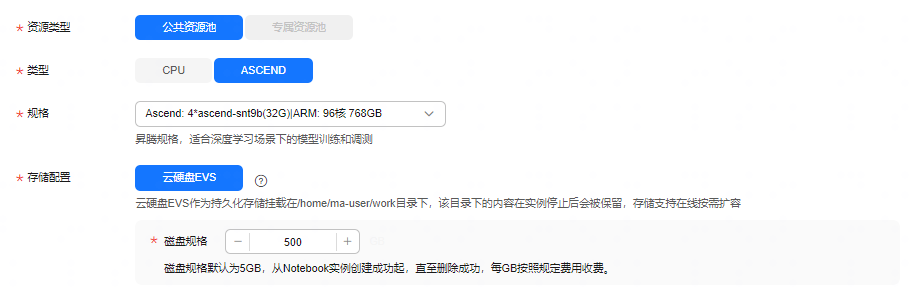
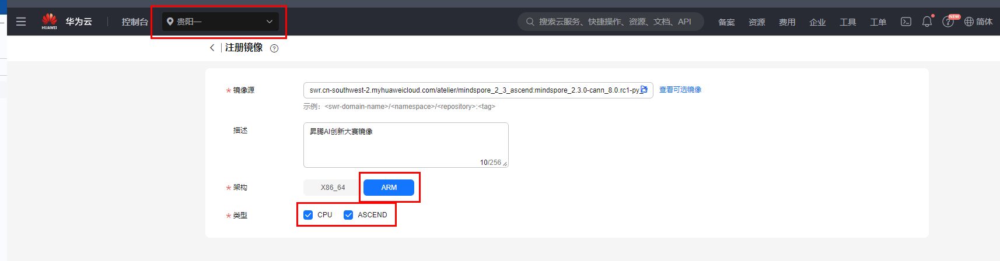

# 模型微调赛题

## 赛题介绍
本赛题要求基于开源中英文混合数学运算数据集，跑通baseline，并对MindFormers中LLama3-8b模型进行微调（LoRA或其他微调算法）。微调后的模型在原有能力不丢失的前提下（需保持在原能力的90%及以上），回答数学运算准确率相对baseline有提升，按照低参比例及准确率进行综合排名。

1. 模型原有能力以其在SQUAD数据集上的阅读理解能力为准，评价标准为F1 Score和Em Score，要求微调后两项评价指标需要给定阈值以上方可算作有效作品，如何进行原有能力评估，以及F1 Score和Em Score的参考阈值，请参考下方-原有能力评估。

2. 运算准确率评价标准：模型基于测试数据集（不公开，与训练数据集格式相同，为数道中英文数学运算题）进行推理，生成数学运算结果，如计算结果（数值）与正确答案相同，则视为本题正确，最终统计在测试数据集上回答正确的题目数量占比。
$$ 运算准确率 = \frac{正确运算题目数}{测试集总题目数} $$

3. 低参比例：低参比例为微调参数量在总参数量的占比，选手在提交作品时需提供低参比例的计算结果，如何进行低参比例详见下方-低参比例运算。
$$ 低参比例 = \frac{参与微调的参数量}{模型总参数量} $$

4. 低参比例和运算准确率综合排名：低参比例越低越好，准算准确率越高越好，按照如下加权进行运算。
$$ (100\%-低参比例)*0.3+运算准确率*0.7 $$

5. 本题目共提供80万条中英文混合题目作为训练数据集，选手可根据自己的实际情况调整数据集规模，建议综合在微调及推理时长、算力需求、维持模型原有能力、模型运算准备率提升等多方面因素进行训练数据集规模的评估。

> 参考：9万条数据集在4卡的LoRA微调下的运行时长为6个小时（seq_len为256，batch_size为64，微调5个epochs）

## 环境配置
本赛题在默认基础环境下，即指定的华为云自定义镜像下，需按照要求额外安装指定的mindspore和mindformers依赖。

此外这里需要另外设置个环境变量，命令如下（环境变量中的路径要与你本地文件的路径一致）：
```shell
export PYTHONPATH="${PYTHONPATH}:/home/ma-user/work/mindformers/"
```

1. 本赛题配置最低可使用华为云modelarts-开发环境-notebook 4卡NPU（32G显存）环境运行，使用的NPU，硬盘规格推荐使用500G，如下图所示设置：




2. 自定义镜像获取

模型微调赛题和推理调优赛题需选择指定镜像来进行开发。首先，请先将站点选择为贵阳一（如下图所示）。

比赛指定的镜像需要注册使用，具体操作参考[此链接](https://support.huaweicloud.com/docker-modelarts/docker-modelarts_6018.html)，流程如下：

**Step 1**：进入ModelArts控制台，单击“镜像管理 > 注册镜像”，进入“注册镜像”页面
**Step 2**： 镜像的SWR地址为：
`swr.cn-southwest-2.myhuaweicloud.com/atelier/mindspore_2_3_ascend:mindspore_2.3.0-cann_8.0.rc1-py_3.9-euler_2.10.7-aarch64-snt9b-20240525100222-259922e`
在注册镜像时填入到”镜像源“处。
**Step 3**：“架构”和“类型”选择“ARM”和“CPU ASCEND”
**Step 4**： 单击”立即注册“，注册后的镜像会显示在镜像管理页面

具体情况如下截图：



3. MindSpore安装

可使用以下命令下载安装包：
```shell
wget https://2024-ascend-innovation-contest-mindspore.obs.cn-southwest-2.myhuaweicloud.com/topic2-finetune/mindspore-2.3.0rc2-cp39-cp39-linux_aarch64.whl
```
通过以下命令安装mindspore：
```shell
pip install mindspore-2.3.0rc2-cp39-cp39-linux_aarch64.whl
```

4. MindFormers安装

可使用以下命令下载安装包：

```shell
wget https://2024-ascend-innovation-contest-mindspore.obs.cn-southwest-2.myhuaweicloud.com/topic2-finetune/mindformers.zip
```
可使用如下命令解压压缩包：
```shell
unzip mindformers.zip
```
使用如下命令安装mindformers：
```shell
cd mindformers/
bash build.sh
```

安装其他依赖，代码如下所示：
```shell
pip install tiktoken
```

***后续操作详见[2024昇腾AI创新大赛MindSpore赛道实验指导手册](../2024昇腾AI创新大赛MindSpore赛道实验指导手册.pdf)***