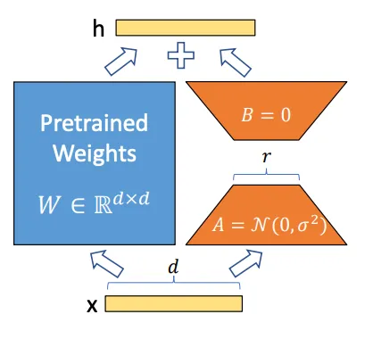
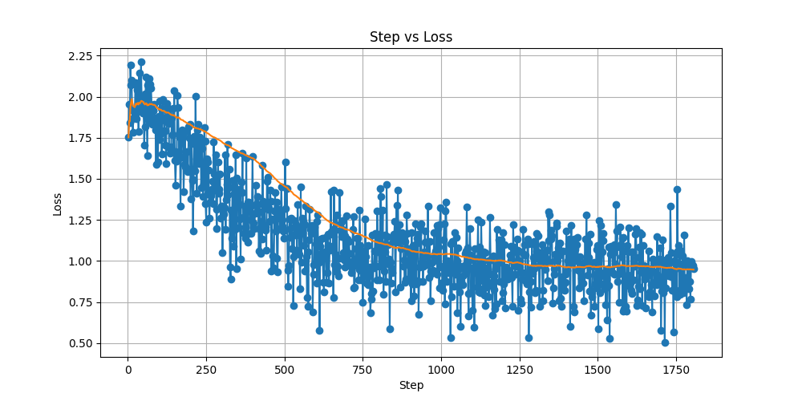

# 模型微调
## 赛题介绍
    本赛题要求基于开源中英文混合数学运算数据集，跑通baseline，并对MindFormers中Llama3-8b模型进行微调（LoRA或其他微调算法）微调后的模型在原有能力不丢失的前提下（需保持在原能力的90%及以上），回答数学运算准确率相对baseline有所提升，按照低参比例及准确率进行综合排名。
    模型原有能力以其在SQUAD数据集上的阅读理解能力为准，评价标准为F1 Score和Em Score，要求微调后两项评价指标需要在给定阈值以上方可算作有效作品。具体如何进行原有能力评估，以及F1 Score和Em Score的参考阈值，请参考下方1.5.8微调后模型原有能力评估。
    数学运算准确率评价标准：模型基于测试数据集（不公开，与训练数据集格式相同，为数道中英文数学运算题）进行推理，生成数学运算结果。如计算结果（数值）与正确答案相同，则视为本题正确，最终统计在测试数据集上回答正确的题目数量占比。

    运算准确率 = 正确运算题目数 / 测试集总题目数

    注：baseline的数学运算准确率为20%，请以此为参考进行微调。
    低参比例：低参比例为微调参数量在总参数量的占比，选手在提交作品时需提供低参比例的计算结果，低参比例运算公式如下。
    低参比例 = 参与微调的参数量 / 模型总参数量
    低参比例和运算准确率综合排名：低参比例越低越好，数学运算准确率越高越好，最终按照如下加权进行运算。

    （100%-低参比例）* 0.3 + 运算准确率 * 0.7


## 微调算法介绍

    模型采用LoRA算法进行微调
    
    LoRA算法介绍：在预训练好的模型结构旁边加入了A和B两个结构，这两个结构的参数分别初始化为高斯分布和0，那么在训练刚开始时附加的参数就是0。



    
    在训练时只更新A、B的参数，预训练好的模型参数是固定不变的，使得即使在小规模的数据集和计算资源下，‌也能实现模型性能的提升。‌

### 训练超参配置介绍说明

- lora配置
    
---
```yaml
    pet_config:
      pet_type: lora
      # configuration of lora
      lora_rank: 12
      lora_alpha: 24
      lora_dropout: 0.05
      target_modules: '.*wq|.*wv'
```
---

- 其他配置修改

```yaml
runner_config:
  epochs: 1
  batch_size: 64
  sink_mode: True
  sink_size: 2

```
### 数据集

    从原始数据集中，选取了前150k作为训练数据集,然后在每次提问时。添加了提示词prompt：
    
---
    ‘你正在进行LoRA微调以加强你的数学处理能力，接下来，你会收到一个数学问题，你必须精准的给出这个数学问题的答案。\n’
    
---
    
### 训练日志

    训练损失变化，位于./mindformers/research/output/msrun_log
    
    具体训练过程，请参考：run.ipynb

### 训练损失变化




## 运行环境

    以下全部脚本，都可以在控制台内执行

### 镜像

    采用官方提供的镜像
    镜像的SWR地址：swr.cn-southwest-2.myhuaweicloud.com/atelier/mindspore_2_3_ascend:mindspore_2.3.0-cann_8.0.rc1-py_3.9-euler_2.10.7-aarch64-snt9b-20240525100222-259922e
    
### 硬件
    Ascend 单卡NPU（显存32G）
    硬盘：>200G
    
### 环境依赖

- mindformers

    下载即安装mindformers


```python
!wget https://2024-ascend-innovation-contest-mindspore.obs.cn-southwest-2.myhuaweicloud.com/topic2-finetune/mindformers.zip
!unzip mindformers.zip
```


```python
%cd /home/ma-user/work/mindformers/
!bash build.sh
```


```python
!export PYTHONPATH="${PYTHONPATH}:/home/ma-user/work/mindformers/"
```

- mindspore

    安装mindspore 2.3.0RC2


```python
!pip install mindspore==2.3.0RC2
```

    Looking in indexes: http://pip.modelarts.private.com:8888/repository/pypi/simple
    Collecting mindspore==2.3.0RC2
      Downloading http://pip.modelarts.private.com:8888/repository/pypi/packages/mindspore/2.3.0rc2/mindspore-2.3.0rc2-cp39-none-any.whl (244.0 MB)
         |████████████████████████████████| 244.0 MB 75.0 MB/s eta 0:00:01
    [?25hRequirement already satisfied: pillow>=6.2.0 in /home/ma-user/anaconda3/envs/MindSpore/lib/python3.9/site-packages (from mindspore==2.3.0RC2) (10.0.1)
    Requirement already satisfied: scipy>=1.5.4 in /home/ma-user/anaconda3/envs/MindSpore/lib/python3.9/site-packages (from mindspore==2.3.0RC2) (1.10.1)
    Requirement already satisfied: numpy>=1.17.0 in /home/ma-user/anaconda3/envs/MindSpore/lib/python3.9/site-packages (from mindspore==2.3.0RC2) (1.22.0)
    Requirement already satisfied: psutil>=5.6.1 in /home/ma-user/anaconda3/envs/MindSpore/lib/python3.9/site-packages (from mindspore==2.3.0RC2) (5.9.5)
    Requirement already satisfied: packaging>=20.0 in /home/ma-user/anaconda3/envs/MindSpore/lib/python3.9/site-packages (from mindspore==2.3.0RC2) (24.0)
    Requirement already satisfied: protobuf>=3.13.0 in /home/ma-user/anaconda3/envs/MindSpore/lib/python3.9/site-packages (from mindspore==2.3.0RC2) (3.20.2)
    Requirement already satisfied: asttokens>=2.0.4 in /home/ma-user/anaconda3/envs/MindSpore/lib/python3.9/site-packages (from mindspore==2.3.0RC2) (2.4.1)
    Requirement already satisfied: astunparse>=1.6.3 in /home/ma-user/anaconda3/envs/MindSpore/lib/python3.9/site-packages (from mindspore==2.3.0RC2) (1.6.3)
    Requirement already satisfied: six>=1.12.0 in /home/ma-user/anaconda3/envs/MindSpore/lib/python3.9/site-packages (from asttokens>=2.0.4->mindspore==2.3.0RC2) (1.16.0)
    Requirement already satisfied: wheel<1.0,>=0.23.0 in /home/ma-user/anaconda3/envs/MindSpore/lib/python3.9/site-packages (from astunparse>=1.6.3->mindspore==2.3.0RC2) (0.38.4)
    Installing collected packages: mindspore
      Attempting uninstall: mindspore
        Found existing installation: mindspore 2.3.0rc4
        Uninstalling mindspore-2.3.0rc4:
          Successfully uninstalled mindspore-2.3.0rc4
    Successfully installed mindspore-2.3.0rc2
    WARNING: You are using pip version 21.0.1; however, version 24.1.2 is available.
    You should consider upgrading via the '/home/ma-user/anaconda3/envs/MindSpore/bin/python3.9 -m pip install --upgrade pip' command.
    

- tiktoken

    安装tiktoken


```python
!pip install tiktoken
```

    Looking in indexes: http://pip.modelarts.private.com:8888/repository/pypi/simple
    Collecting tiktoken
      Downloading http://pip.modelarts.private.com:8888/repository/pypi/packages/tiktoken/0.7.0/tiktoken-0.7.0-cp39-cp39-manylinux_2_17_aarch64.manylinux2014_aarch64.whl (1.0 MB)
         |████████████████████████████████| 1.0 MB 56.7 MB/s eta 0:00:01
    [?25hRequirement already satisfied: requests>=2.26.0 in /home/ma-user/anaconda3/envs/MindSpore/lib/python3.9/site-packages (from tiktoken) (2.27.1)
    Requirement already satisfied: regex>=2022.1.18 in /home/ma-user/anaconda3/envs/MindSpore/lib/python3.9/site-packages (from tiktoken) (2024.5.15)
    Requirement already satisfied: idna<4,>=2.5 in /home/ma-user/anaconda3/envs/MindSpore/lib/python3.9/site-packages (from requests>=2.26.0->tiktoken) (2.10)
    Requirement already satisfied: certifi>=2017.4.17 in /home/ma-user/anaconda3/envs/MindSpore/lib/python3.9/site-packages (from requests>=2.26.0->tiktoken) (2024.2.2)
    Requirement already satisfied: charset-normalizer~=2.0.0 in /home/ma-user/anaconda3/envs/MindSpore/lib/python3.9/site-packages (from requests>=2.26.0->tiktoken) (2.0.12)
    Requirement already satisfied: urllib3<1.27,>=1.21.1 in /home/ma-user/anaconda3/envs/MindSpore/lib/python3.9/site-packages (from requests>=2.26.0->tiktoken) (1.26.7)
    Installing collected packages: tiktoken
    Successfully installed tiktoken-0.7.0
    WARNING: You are using pip version 21.0.1; however, version 24.1.2 is available.
    You should consider upgrading via the '/home/ma-user/anaconda3/envs/MindSpore/bin/python3.9 -m pip install --upgrade pip' command.
    

### 微调后的模型权重下载


```python
%cd /home/ma-user/work
!mkdir model
!mkdir model/rank_0/
!wget https://llama3.obs.cn-southwest-2.myhuaweicloud.com/new_lora_checkpoint_0.ckpt -P ./model/rank_0/
```

    /home/ma-user/work
    --2024-07-27 15:05:34--  https://llama3.obs.cn-southwest-2.myhuaweicloud.com/new_lora_checkpoint_0.ckpt
    Resolving llama3.obs.cn-southwest-2.myhuaweicloud.com (llama3.obs.cn-southwest-2.myhuaweicloud.com)... 100.125.81.67, 100.125.81.35, 100.125.81.3
    Connecting to llama3.obs.cn-southwest-2.myhuaweicloud.com (llama3.obs.cn-southwest-2.myhuaweicloud.com)|100.125.81.67|:443... connected.
    HTTP request sent, awaiting response... 200 OK
    Length: 16071307975 (15G) [binary/octet-stream]
    Saving to: ‘./model/rank_0/new_lora_checkpoint_0.ckpt’
    
    new_lora_checkpoint  63%[===========>        ]   9.52G  47.0MB/s    eta 2m 5s  


```python
!wget https://2024-ascend-innovation-contest-mindspore.obs.cn-southwest-2.myhuaweicloud.com/topic2-finetune/tokenizer.model -P ./model 
```

## 原有性能评测

    运行过程中完整日志详见 log/ev-v1.1_eval.log


```python
%cd /home/ma-user/work/mindformers
!python run_mindformer.py \
--config /home/ma-user/work/run_llama3_8b_8k_800T_A2_64G_lora_256_base_eval.yaml \
--eval_dataset_dir /home/ma-user/work/data/squad8192.mindrecord \
--run_mode eval \
--load_checkpoint /home/ma-user/work/model/rank_0/new_lora_checkpoint_0.ckpt \
--epochs 1 \
--batch_size 1 \
--use_parallel False \
--device_id 0 \
> /home/ma-user/work/log/dev-v1.1_eval.log 2>&1 &
```

### 原有性能得分:


```python
%cd /home/ma-user/work
import step_loss_plot as slp

slp.find_scores_from_file('./log/dev-v1.1_eval.log')

```

    /home/ma-user/work
    

    /home/ma-user/anaconda3/envs/MindSpore/lib/python3.9/site-packages/IPython/core/magics/osm.py:417: UserWarning: using dhist requires you to install the `pickleshare` library.
      self.shell.db['dhist'] = compress_dhist(dhist)[-100:]
    

    F1 score: 65.42232999478914, Em score: 49.685534591194966, total_count: 2067
    None
    

## 微调参数比例计算


```python
%cd /home/ma-user/work/mindformers/research/output/msrun_log
!cat worker_0.log |grep "Network Parameters"
```

    /home/ma-user/anaconda3/envs/MindSpore/lib/python3.9/site-packages/IPython/core/magics/osm.py:417: UserWarning: using dhist requires you to install the `pickleshare` library.
      self.shell.db['dhist'] = compress_dhist(dhist)[-100:]
    

    /home/ma-user/work/mindformers/research/output/msrun_log
    2024-07-27 14:01:02,516 - mindformers[mindformers/trainer/base_trainer.py:543] - INFO - Network Parameters: 5111808.
    


```python
ratio = 5111808/8030000000
print(f"低参比例:{ratio*100}%")
```

    低参比例:0.0636588792029888%
    

## 执行推理

    执行推理前，需要保证前面运行环境和微调后的权重已经执行。
    需要将input_dir替换成实际的推理文件路径。
    
    生成的.npy文件位于/home/ma-user/work下，以用于后续评估
    
    运行过程中日志位于/home/ma-user/work/log/data_test_2000_1


```python
%cd /home/ma-user/work
!python run_llama3_test.py \
--config /home/ma-user/work/run_llama3_8b_8k_800T_A2_64G_lora_256_eval.yaml \
--run_mode predict \
--use_parallel False \
--load_checkpoint /home/ma-user/work/model/rank_0/new_lora_checkpoint_0.ckpt \
--vocab_file /home/ma-user/work/model/tokenizer.model \
--auto_trans_ckpt False \
--input_dir "/home/ma-user/work/data/test_128.json" \
> /home/ma-user/work/log/data_test_2000_1.log 2>&1 &
```

## 准确性评估

    评估方法说明：
    考虑到模型生成的结果并非简单的计算结果，还包含运算过程或则关于运算的解答，因此在这里，简单的使用了data/test_128.json这个包含128条随机选择数据的内容进行简单评估。
    此数据中答案只包含数字，例子：
---
- {"problem": "计算 -7970.16 + 1044.40 等于多少？", "solution": "-6925.76"}
- {"problem": "计算 -1269.54 * 6163.96 等于多少？", "solution": "-7825393.7784"}
- {"problem": "计算 -5413.82 + 8826.70 等于多少？", "solution": "3412.88"}
- {"problem": "计算 2415.96 / -2695.89 等于多少？", "solution": "-0.8961641"}
---

    评估准确性，只考虑了微调后的模型推理结果内，是否包含准确答案的数字。
    如果包含则视为回答正确。
    
    
    此评估结果只作为参考。
    
### baseline数学准确性参考

    


```python
%cd /home/ma-user/work
!python accurate_evaluation.py --test_path=./data/test_128.json --answer_path=result_npy_base.npy
```

    /home/ma-user/work
    模型准确性:21.09375%
    

### 微调后模型数学准确性


```python
%cd /home/ma-user/work
!python accurate_evaluation.py --test_path=./data/test_128.json --answer_path=result_npy.npy
```

    /home/ma-user/work
    Traceback (most recent call last):
      File "/home/ma-user/work/accurate_evaluation.py", line 47, in <module>
        calculate_accuracy(args.test_path,args.answer_path)
      File "/home/ma-user/work/accurate_evaluation.py", line 29, in calculate_accuracy
        resluts  = read_npy_to_list(answer_path)
      File "/home/ma-user/work/accurate_evaluation.py", line 20, in read_npy_to_list
        array = np.load(input_file_path,allow_pickle=True)
      File "/home/ma-user/anaconda3/envs/MindSpore/lib/python3.9/site-packages/numpy/lib/npyio.py", line 407, in load
        fid = stack.enter_context(open(os_fspath(file), "rb"))
    FileNotFoundError: [Errno 2] No such file or directory: 'result_npy.npy'
    
