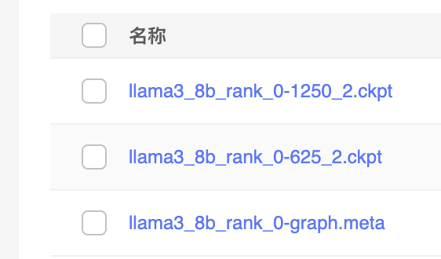
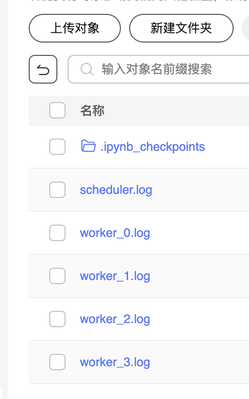
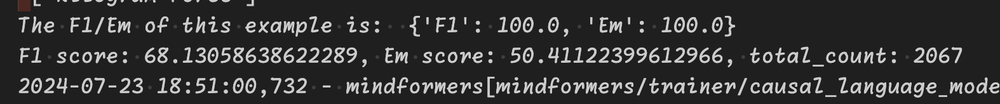

# 1. 微调算法

使用lora微调算法。对数据进行4w条随机取样。
prompt为：

```python
"prompt_no_input": (
        "Give a answer to the following mathematical equation that appropriately completes the request.\n\n"
        "### Instruction:\n{problem}\n"
    ),
```

# 2. 超参配置
```
   pet_type: lora
      # configuration of lora
      lora_rank: 16
      lora_alpha: 16
      lora_dropout: 0.05
      target_modules: '.*wq|.*wv|.*wk|.*wo'
```


# 3. 权重文件链接
目录链接 https://llama-tune.obs.cn-southwest-2.myhuaweicloud.com/second-ckpt/

目录结构

- second-ckpt
 - 40000_half_lora_checkpoint_0.ckpt     https://llama-tune.obs.cn-southwest-2.myhuaweicloud.com/second-ckpt/40000_half_lora_checkpoint_0.ckpt
 - out
   - output
    - checkpoint 
    - msrun_log
    - ...






# 4. 运行环境说明

无新增修改

# 5. 模型微调后原有能力评分


