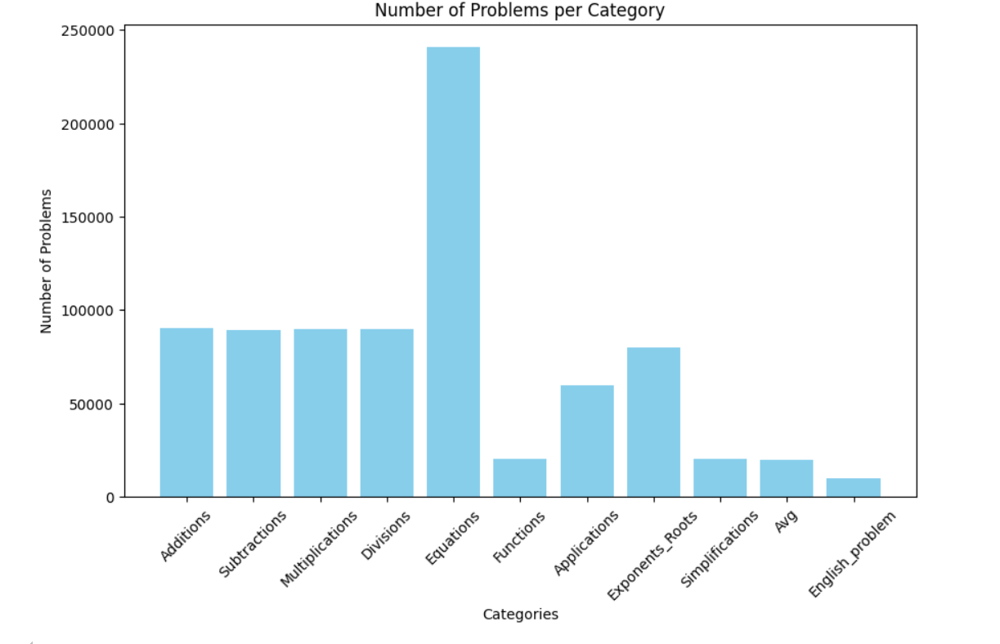
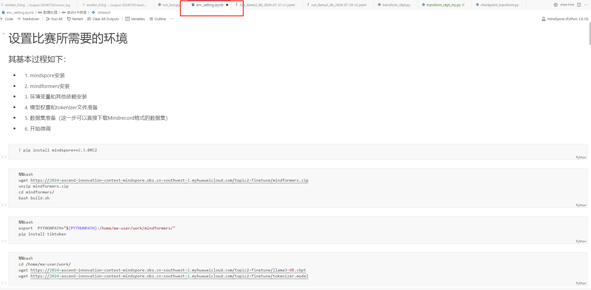

# 模型微调作品报告

## 一	微调算法介绍：

1-1	微调方法
微调方法采用了Lora微调方法，在测试ptune-v2时，因为时间紧张，故放弃。

在lora测试中，对attention的所有层的wq和wv进行了微调，因为不了解layer选择与排除方法，因此也没有设定某层进行排除，选择了大力飞砖。
Lora的参数设置如表1-1所示。

Lora参数设置:

pet_type	lora

Lora_rank	8

Lora_alpha	16

Lora_dropout	0.0

Target_modules	‘.*wq|*.wv’

表1-1：Lora参数设置

1-2	数据集处理
数据集处理的时候对数据进行了筛选，经过多次尝试，发现对如果引入英文数据QA，会造成模型能力的下降，虽然在英文数据集在格式上解释性更强，但对简单数据的微调上表现并不好，也有相关的论文指出了这一点。因此在数据上全部采用了中文数据集作训练。我也对数据集做了一定的探索，整体的问题比例可以查看图1-1。跟随着整体比例与前期的一些测试结果，最终将微调数据集的大小106000，各问题的具体条数为见表1-2，训练时间整体上也有一个较好的把控。

图1-1：数学问题微调数据集问题比例图

微调训练数据集各类型数据统计：

方程计算	25000

加法计算	5000

减法计算	5000

乘法计算	5000

除法计算	5000

函数计算	10000

次方或根号计算	17000

化简计算	7000

均值计算	7000

应用题计算	20000

表1-2：微调训练数据集各类型数据统计

## 二	超参数配置介绍说明：

这里的重要超参数分别列为runner_config、optimizer、lr_schedule，分别如下。

2-1 runner_config
Runner_config参数设置：

epochs	6

batch_size	64

sink_mode	True

sink_size	2

表2-1：Runner_config参数设置

2-2 optimizer

optimizer参数设置

type	FP32StateAdamWeightDecay

beta1	0.9

btea2	0.95

esp	1e-8

weight_decay	0.01

表2-2：optimizer参数设置

2-3 lr_schedule

lr_schedule参数设置：

type	CosineWithWarmUpLR

learning_rate	3e-5

lr_end	1e-6

warmup_ratio	0.03

total_steps	-1

表2-3：lr_schedule参数设置

## 三	微调后权重文件链接

权重文件获取obs链接为：https://modelart-kervin.obs.cn-southwest-2.myhuaweicloud.com/model_tuning/牛牛向前冲-常科.tar.gz，合并后的ckpt位置在对应压缩保重的merged_checkpoint中。

## 四	环境配置文件说明

为更好地执行任务，特意设置了env_setting的jupyter脚本，按照脚本中进行配置即可，获取链接为压缩包链接。

## 五	模型原有能力评估得分

原有能力评估得分：

F1 score: 63.163793475777844, Em score: 47.41830065359477

## 六	数学公式推理方法

与原始能力评估方法类似。

## 七	相关附件

7-1 模型微调的完整日志与yaml格式配置文件
已放入华为obs桶中，相关链接为：
https://modelart-kervin.obs.cn-southwest-2.myhuaweicloud.com/model_tuning/牛牛向前冲-常科.tar.gz

7-2 全流程mindformers源码包

未对源码修改

7-3 原有能力评估完整日志

详见obs桶：
https://modelart-kervin.obs.cn-southwest-2.myhuaweicloud.com/model_tuning/牛牛向前冲-常科.tar.gz

