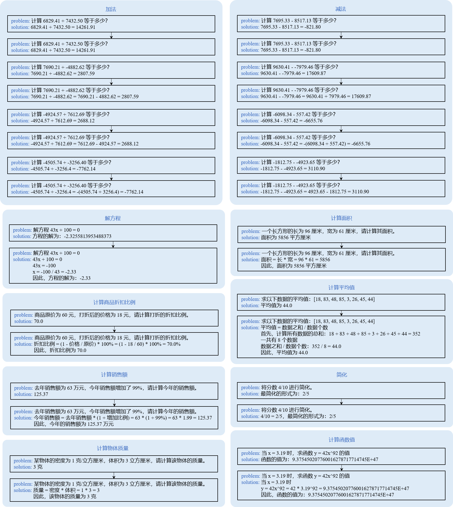
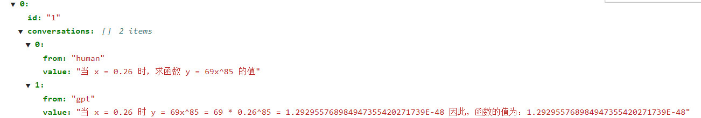
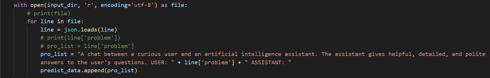

# 作品报告

> 团队：肆拾贰


## 【文件说明】

```
- config                                                       # 配置文件
	- lora_finetune.yaml                                       # lora微调配置文件
	- math_eval.yaml                                           # 数学推理配置文件
    - run_llama3_8b_8k_800T_A2_64G_lora_256_base_eval.yaml     # 原有能力测试配置文件
    - run_llama3_test.py                                       # 数学推理脚本
- data_preprocess						# 数据预处理
	- data_converter.py                                      # 数据集添加prompt模板
	- data_preprocess.ipynb                               # 数据去重、分类、CoT、采样构建训练集
- img							       # 存储作品报告.md文件的图片
- log                                                          # 日志文件
	- base_eval_log_epoch_1.log                                # epoch_1权重的模型原有能力评估日志
	- base_eval_log_epoch_2.log                                # epoch_2权重的模型原有能力评估日志
    - base_eval_log_epoch_3.log                                # epoch_3权重的模型原有能力评估日志
    - base_eval_log_epoch_4.log                                # epoch_4权重的模型原有能力评估日志
    - base_eval_log_epoch_5.log                                # epoch_5权重的模型原有能力评估日志
	- lora_finetune.log                                        # lora微调日志
```


## 一、数据预处理

#### 1、剔除原始数据train.json中重复的数据，分类数据集以及采样得到训练集

原始数据有 809993 条，剔除重复数据后剩下 548942 条。

按照题型的不同将数据分为 15 个类别并采样制作训练集（97450条），其中 `计算物体质量` 题型和 `简化` 题型由于数据量较少，故10倍采样。

| 题型 | 英文 | 加法 | 减法 | 乘法 | 除法 | 平方根 | 乘方 | 解方程 | 计算商品折扣比例 | 计算平均值 | 计算物体质量 | 计算面积 | 计算销售额 | 简化 | 计算函数值 |  总计  |
| :---: | :---: | :---: | :---: | :---: | :---: | :---: | :---: | :---: | :---: | :---: | :---: | :---: | :---: | :---: | :---: | :---: |
| 数量 | 9993 | 90113 | 89366 | 89902 | 89966 | 39227 | 39207 | 40080 | 6275 | 19709 | 100 | 8665 | 6266 | 45 | 20028 | 548942 |
| 采样 | 6000 | 6000 | 6000 | 6000 | 6000 | 6000 | 6000 | 12000 | 6000 | 12000 | 1000 | 6000 | 6000 | 450 | 12000 | 97450 |


#### 2、分类构建 CoT 数据集（补全推理过程）

其中 `英文` `乘法` `除法` `平方根` `乘方` 题型保持不变，其它题型补全推理过程，`加法` `减法` `乘法` `除法` `平方根` `乘方` `解方程` `计算商品折扣比例` `计算平均值` `计算销售额` 题型结果保留两位小数，如下图所示：





① 原始数据集准备

```
cd /home/ma-user/work/
wget https://2024-ascend-innovation-contest-mindspore.obs.cn-southwest-2.myhuaweicloud.com/topic2-finetune/train.json
```

② 运行提交的压缩包中的 `data_preprocess/data_preprocess.ipynb`，得到去重、分类、CoT、采样后的训练集 `train_dataset.json`


#### 3、添加 prompt 模板

重写了 手册提供的 `data_converter.py` 文件，删除多余的 prompt，修改完数据格式如下图所示：





运行提交的压缩包中的 `data_preprocess/data_converter.py`，得到添加模板后的训练集 `train-data-conversation.json`。

```
python data_converter.py --data_path /home/ma-user/work/train_dataset.json --output_path /home/ma-user/work/train-data-conversation.json
```


#### 4、生成MindRecord格式数据

采用手册提供的脚本转换为MindRecord格式，其中设置seq_length=512。

```
cd /home/ma-user/work/mindformers/research/llama3

python llama_preprocess.py \
--dataset_type qa \
--input_glob /home/ma-user/work/train-data-conversation.json \
--model_file /home/ma-user/work/tokenizer.model \
--seq_length 512 \
--output_file /home/ma-user/work/train-fastchat512.mindrecord
```


#### 5、提供预处理后的数据集链接（obs桶）

train_dataset.json: https://lora42.obs.cn-southwest-2.myhuaweicloud.com/v3/train_dataset.json

train-data-conversation.json: https://lora42.obs.cn-southwest-2.myhuaweicloud.com/v3/train-data-conversation.json

train-fastchat512.mindrecord: https://lora42.obs.cn-southwest-2.myhuaweicloud.com/v3/train-fastchat512.mindrecord

train-fastchat512.mindrecord.db: https://lora42.obs.cn-southwest-2.myhuaweicloud.com/v3/train-fastchat512.mindrecord.db


## 二、微调算法

采用 LoRA 微调：

```
lora_rank: 8
lora_alpha: 16
lora_dropout: 0.05
target_modules: '.*wq | .*wv'
```


#### 1、微调超参数

提供了修改完的微调配置文件，在提交的压缩包中的 `config/lora_finetune.yaml`。

主要基于手册提供的 `run_llama3_8b_8k_800T_A2_64G_lora_dis_256.yaml` 做以下修改，其它与手册保持一致，采用4卡微调。

```yaml
# runner config
runner_config:
  epochs: 5
  batch_size: 32

# callbacks
callbacks:
  - type: CheckpointMointor
    save_checkpoint_steps: 3045

# model config
model:
  model_config:
    seq_length: 512
    pet_config:
      pet_type: lora
      # configuration of lora
      lora_rank: 8
      lora_alpha: 16
      lora_dropout: 0.05
      target_modules: '.*wq|.*wv'
  	
```

#### 2、原有能力评估超参数

与手册提供的配置文件和方法保持一致，运行时模型权重指定为微调后的权重就可以。


#### 3、数学推理超参数

提供了修改后的推理配置文件，在提交的压缩包中的 `config/math_eval.yaml`。

主要基于手册提供的配置文件 `run_llama3_8b_8k_800T_A2_64G_lora_256_eval.yaml` 做以下修改，其它参数以及推理脚本和手册保持一致。

```yaml
# model config
model:
  model_config:
    pet_config:
      pet_type: lora
      # configuration of lora
      lora_rank: 8
      lora_alpha: 16
      lora_dropout: 0.05
      target_modules: '.*wq|.*wv'
```


## 三、微调后的权重文件链接（obs桶）

训练了5个epoch，保存了5份权重，存储在obs桶：

epoch_1: https://lora42.obs.cn-southwest-2.myhuaweicloud.com/v3/lora_checkpoint_epoch_1.ckpt

epoch_2: https://lora42.obs.cn-southwest-2.myhuaweicloud.com/v3/lora_checkpoint_epoch_2.ckpt

epoch_3: https://lora42.obs.cn-southwest-2.myhuaweicloud.com/v3/lora_checkpoint_epoch_3.ckpt

epoch_4: https://lora42.obs.cn-southwest-2.myhuaweicloud.com/v3/lora_checkpoint_epoch_4.ckpt

epoch_5: https://lora42.obs.cn-southwest-2.myhuaweicloud.com/v3/lora_checkpoint_epoch_5.ckpt


## 四、运行环境说明

与手册1.5.2 环境配置章节保持一致，微调用4卡，推理单卡。


## 五、模型微调后原有能力评估得分

训练了5个epoch，保存了5份权重，每份权重的原有能力评估得分如下（均达标）：

|  model   | epoch_1 | epoch_2 | epoch_3 | epoch_4 | epoch_5 |
| :------: | :-----: | :-----: | :-----: | :-----: | :-----: |
| F1 score |  67.72  |  68.23  |  69.98  |  69.88  |  69.86  |
| Em score |  51.04  |  51.13  |  52.58  |  52.44  |  52.34  |


## 六、数学推理方式

> 此处提供推理用的脚本和配置文件：
>
> 推理脚本见压缩包中的 `config/run_llama3_test.py`
>
> 配置文件见压缩包中的 `config/math_eval.yaml` 


在手册提供的推理脚本的基础上增加了 prompt ，如下图所示：



添加该 prompt 的原因是在构建训练集的过程中，转换为 mindrecord 格式时，脚本自动添加了该指定身份信息的 prompt ，故推理时需要将该 prompt 补上去。


推理运行（将配置文件路径、模型权重路径、测试集路径替换成自己的）：

```
cd /home/ma-user/work/mindformers/research

python llama3/run_llama3_test.py \
--config /{path}/math_eval.yaml
--run_mode predict \
--use_parallel False \
--load_checkpoint /{path}/{lora_checkpoint_epoch_n.ckpt} \
--vocab_file /{path}/tokenizer.model \
--auto_trans_ckpt False \
--input_dir "/{path}/data_2000_1_random.json" > data_test_2000_1.log 2>&1 &
```


## 七、低参比例


3407872 / 8030000000 = 0.000424392528019


## 八、可供运行的 mindformers 源码包（obs桶）

https://lora42.obs.cn-southwest-2.myhuaweicloud.com/v3/mindformers.zip

- 其中，数据预处理脚本位于 `mindformers/data_preprocess/` 文件夹下:

​		`data_preprocess.ipynb`

​		`data_converter.py`

- 微调配置文件位于 `mindformers/research/llama3/lora_finetune.yaml`
- 原有能力评估配置文件位于 ``mindformers/research/llama3/run_llama3_8b_8k_800T_A2_64G_lora_256_base_eval.yaml`

- 数学推理配置文件位于 `mindformers/research/llama3/math_eval.yaml`

- 数学推理脚本位于 `mindformers/research/llama3/run_llama3_test.py`

- 源码包中提供的配置文件和推理脚本与作品提交的压缩包中的配置文件和推理脚本是一样的，用哪个都行。
