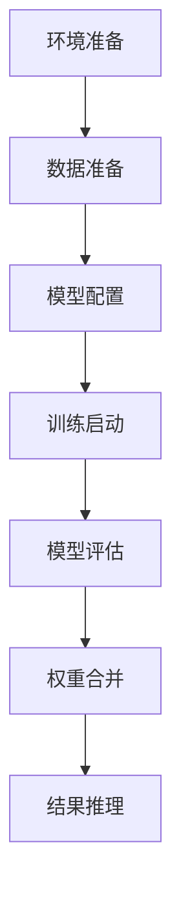

# 🚀 [ALL IN ONE]
## 模型微调赛
https://chi-2024.obs.cn-southwest-2.myhuaweicloud.com/2024-llm-stage2/

## 📑 目录

1. [微调算法介绍](#1-微调算法介绍)
2. [微调全流程实现](#2-微调全流程实现)
3. [环境配置详情](#3-环境配置详情)
4. [数据集处理方法](#4-数据集处理方法)
5. [模型配置与参数](#5-模型配置与参数)
6. [训练与评估](#6-训练与评估)
7. [推理部署](#7-推理部署)
8. [附件说明](#8-附件说明)

## 1. 微调算法介绍

### 🔍 LoRA (Low-Rank Adaptation) 算法

#### 核心原理
LoRA通过在预训练模型中注入可训练的低秩矩阵来实现高效微调：

```python
ΔW = BA  # 其中B∈ℝ^{d×r}, A∈ℝ^{r×k}
```

- 预训练权重保持冻结
- 仅训练低秩矩阵A和B
- 秩r通常远小于原始维度（如r=8,16）

#### 实现配置
根据配置文件，本项目LoRA参数如下：
```yaml
pet_config:
  pet_type: lora
  lora_rank: 8
  lora_alpha: 16
  lora_dropout: 0.05
  target_modules: '.*wq|.*wk|.*wv|.*wo'
```

#### 优化策略
- 使用Adam优化器
- 余弦学习率调度
- 动态损失缩放
- 梯度裁剪

## 2. 微调全流程实现

### 2.1 基本信息
- 基座模型：InternLM-7B 
- 微调方法：LoRA
- 目标任务：提升选择题准确率
- 评估指标：低参比例 + 准确率

### 2.2 实现流程



## 3. 环境配置详情

### 3.1 硬件环境
- 计算平台：华为云ModelArts
- 计算资源：4卡NPU（Ascend 910B）
- 内存配置：64GB显存/卡
- 存储空间：500GB

### 3.2 软件环境
```bash
# 基础环境
MindSpore==2.3.0RC2
MindFormers=={specific_version}
tiktoken
```

## 4. 数据集处理方法

### 4.1 数据集信息
1. MMLU数据集
2. CMMLU数据集
3. SQUAD数据集（评估用）

### 4.2 处理流程
1. CSV转JSON（Alpaca格式）
```python
{
    "instruction": "根据问题选择正确答案",
    "input": "问题内容",
    "output": "正确选项"
}
```

2. JSON转MindRecord
```bash
python transform_dataset.py \
    --input alpaca_format.json \
    --output mindrecord/ \
    --num_shards 4
```

## 5. 模型配置与参数

### 5.1 训练超参数
```yaml
# 训练相关
epochs: 10
batch_size: 4
learning_rate: 5.e-5
warmup_ratio: 0.03

# 并行策略
data_parallel: 4
model_parallel: 1
pipeline_stage: 1
```

### 5.2 优化器配置
```yaml
optimizer:
  type: FP32StateAdamWeightDecay
  beta1: 0.9
  beta2: 0.999
  eps: 1.e-8
  weight_decay: 0.01
```

### 5.3 调度器配置
```yaml
lr_schedule:
  type: CosineWithWarmUpLR
  learning_rate: 5.e-5
  warmup_ratio: 0.03
```

## 6. 训练与评估

### 6.1 训练启动
```bash
# 4卡训练启动命令
bash scripts/msrun_launcher.sh "python research/internlm/run_internlm.py --run_mode finetune --use_parallel True --config research/internlm/finetune_internlm_7b_lora_mmlu_64G.yaml --load_checkpoint /home/ma-user/work/stage2/internlm.ckpt --auto_trans_ckpt True --train_dataset /home/ma-user/work/stage2/mmlu/mmlu.mindrecord" 4
```

### 6.2 模型评估
在SQUAD数据集上进行评估：
```bash
python run_internlm.py \
--config predict_internlm_7b_eval_squad.yaml \
--run_mode eval \
--load_checkpoint /home/ma-user/work/new_lora_checkpoint_0.ckpt \
--use_parallel False \
--eval_dataset /home/ma-user/work/squad8192.mindrecord > eval_squad.log 2>&1 &
```
- F1 Score: [53.882715209537615]
- EM Score: [31.591678761490083]

### 6.3 参数效率
- 总参数量: 7B
- 可训练参数量: [8.3M]
- 参数比例: [0.1146]%

## 7. 测试推理
```bash
python run_internlm.py \
--config predict_internlm_7b_mmlu.yaml \
--run_mode predict \
--use_parallel false \
--load_checkpoint /home/ma-user/work/stage2/mindformers/output/checkpoint/rank_0/new_lora_checkpoint_0.ckpt \
--auto_trans_ckpt false \
--input_dir /home/ma-user/work/stage2/mmlu/mmlu_alpaca_format2000.json > predict2000.log 2>&1 &
```
### 7.1 权重合并
```bash
cd /home/ma-user/work/mindformers/

python mindformers/tools/transform_ckpt.py \
--src_ckpt_strategy /home/ma-user/work/mindformers/output/strategy/ \
--src_ckpt_dir /home/ma-user/work/mindformers/output/checkpoint/ \
--dst_ckpt_dir /home/ma-user/work/mindformers/output/checkpoint/ \
--prefix "new_lora_checkpoint_"
```

### 7.2 推理配置
```yaml
model_config:
  batch_size: 8
  max_device_memory: "58GB"
  vocab_file: "path/to/vocab"
```

### 7.3 推理执行
```bash
python predict.py \
    --config_path predict_config.yaml \
    --input_file test.json \
    --output_file results.npy
```

## 8. 附件说明

### 📁 文件清单
- ✅ 训练日志
- ✅ 配置文件
    - 训练、原有能力评估、推理的配置文件：https://chi-2024.obs.cn-southwest-2.myhuaweicloud.com/2024-llm-stage2/config/
- ✅ 评估结果
    - https://chi-2024.obs.cn-southwest-2.myhuaweicloud.com/2024-llm-stage2/result/
- ✅ 模型权重
    - https://chi-2024.obs.cn-southwest-2.myhuaweicloud.com/2024-llm-stage2/lora/
- ✅ Mindformers
    - https://chi-2024.obs.cn-southwest-2.myhuaweicloud.com/2024-llm-stage2/mindformers/mindformers/


---
💡 注：本报告使用Markdown格式编写，支持导出为PDF等其他格式。所有配置路径和参数均可根据实际情况调整。