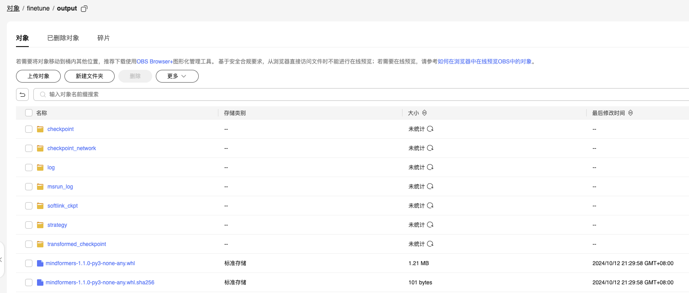
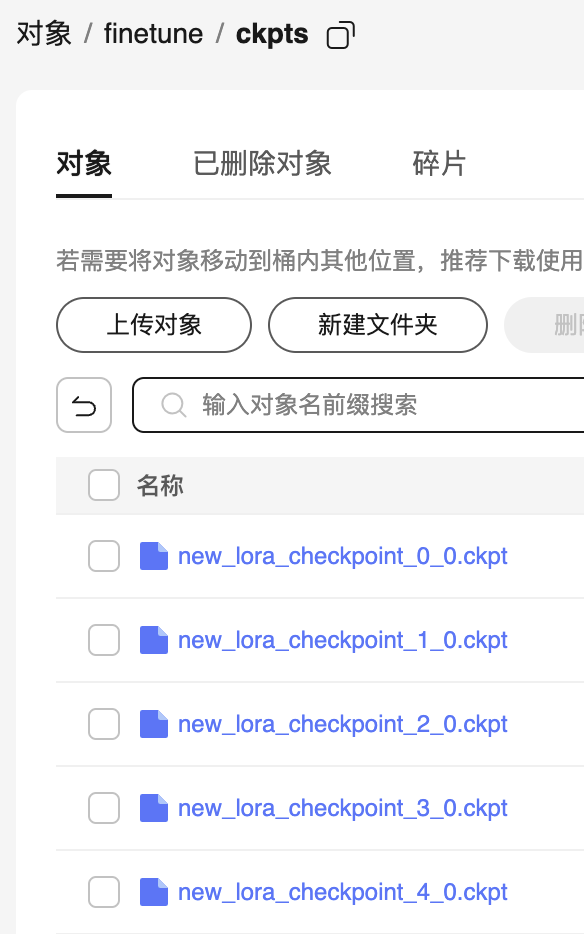
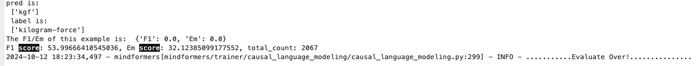

# 菜鸟队

## 队伍成员
    - 队长：余硕博

# 微调算法

使用 lora 微调算法，修改lora超参进行微调。对整个微调数据集进行训练，训练10个周期。

# 超参配置

```yaml
runner_config:
    epochs: 10 # 训练 10 个周期

callbacks: 
    save_checkpoint_steps: 3450 # 根据数据计算得出每两个周期保存一次

pet_config:
    lora_rank: 16
    lora_alpha: 32 
```


# obs存储

根路径：https://llm-tune-obs.obs.cn-southwest-2.myhuaweicloud.com/finetune/


`output`目录是直接上传过来的




# 权重文件



最优权重：'https://llm-tune-obs.obs.cn-southwest-2.myhuaweicloud.com/finetune/ckpts/new_lora_checkpoint_4_0.ckpt'

# 运行环境

无额外配置

# 原有能力评估得分




# 微调日志和 yaml 配置文件

微调日志在合并权重的时候执行 `only_save_strategy: True` 时被覆盖了。

其他日志在obs `output` 目录下

微调yaml文件 : `Finetune InternLM 7B LoRa.yaml`

# mindformers 源码包

链接：https://llm-tune-obs.obs.cn-southwest-2.myhuaweicloud.com/finetune/mindformers.zip

# 原有能力评估日志文件

  eval_squad.log