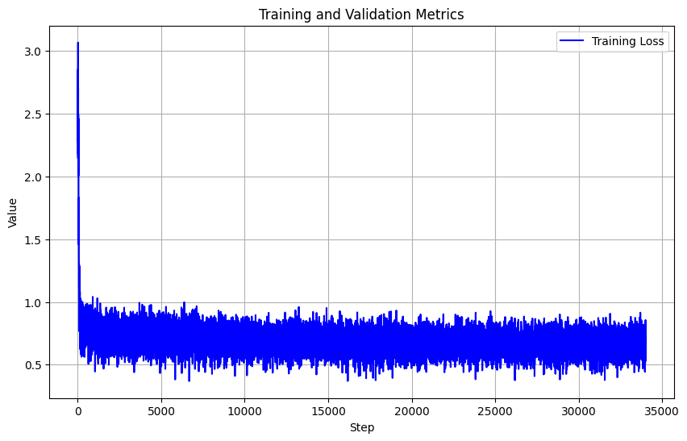
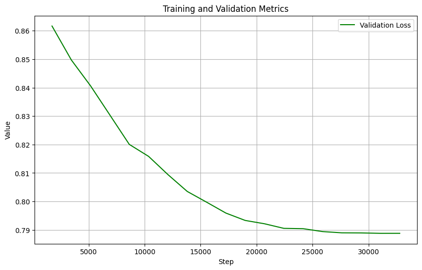
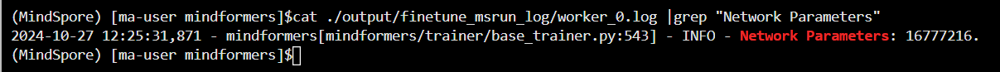

# 作品报告

## 【文件说明】

```
lora_finetune.yaml                                       # lora微调配置文件
predict_eval_squad.yaml                                  # 原有能力测试配置文件
predict_mmlu.yaml                                        # 推理配置文件
mmlu_cmmlu_csv2json.py                                   # 数据集csv转json格式脚本
data_preprocess.py                                       # 数据预处理脚本
alpaca_data_preprocess_v1.py                             # json转mindrecord格式（修复了手册文件的bug）
img												         # 存储作品报告.md文件的图片
```


## 一、数据预处理

#### 1、csv转json格式

> 根据手册获取MMLU和CMMLU的原始数据集
>
> 运行`mmlu_cmmlu_csv2json.py`，注意将脚本中数据集的路径和保存路径改为自己对应的路径


#### 2、打乱数据的选项，构建新数据，划分数据集

> 运行`data_preprocess.py`，注意将脚本中数据集的路径和保存路径改为自己对应的路径


**（1）针对数据集的每个样本，构建6个新数据，新数据补全了的output选项的完整答案，第2-6个数据ABCD四个选项的位置进行了重新排序，示例如下：**

**原始数据：**

```json
{
	"instruction": "Here is a question about college engineering hydrology, the correct answer is one of the options A/B/C/D. Please select the correct option and answer the question with 'The right option is'.",
	"input": "Question: 下渗率总是[ ]。 \nA.小于、等于下渗能力\nB.等于下渗能力\nC.小于下渗能力\nD.大于下渗能力",
	"output": "The right option is A."
}
```

**新数据：**

第1个新数据（只补全了的output选项的完整答案）：

```json
{
	"instruction": "Here is a question about college engineering hydrology, the correct answer is one of the options A/B/C/D. Please select the correct option and answer the question with 'The right option is'.",
	"input": "Question: 下渗率总是[ ]。 \nA.小于、等于下渗能力\nB.等于下渗能力\nC.小于下渗能力\nD.大于下渗能力",
	"output": "The right option is A.小于、等于下渗能力"
}
```
第2-6个新数据（补全了的output选项的完整答案，并对选项的顺序进行了重新排序）：

```json
{
    "instruction": "Here is a question about college engineering hydrology, the correct answer is one of the options A/B/C/D. Please select the correct option and answer the question with 'The right option is'.",
    "input": "Question: 下渗率总是[ ]。 \nA.小于下渗能力\nB.等于下渗能力\nC.大于下渗能力\nD.小于、等于下渗能力",
    "output": "The right option is D.小于、等于下渗能力"
}
```

```json
{
    "instruction": "Here is a question about college engineering hydrology, the correct answer is one of the options A/B/C/D. Please select the correct option and answer the question with 'The right option is'.",
    "input": "Question: 下渗率总是[ ]。 \nA.大于下渗能力\nB.小于下渗能力\nC.小于、等于下渗能力\nD.等于下渗能力",
    "output": "The right option is C.小于、等于下渗能力"
}
```

```json
{
    "instruction": "Here is a question about college engineering hydrology, the correct answer is one of the options A/B/C/D. Please select the correct option and answer the question with 'The right option is'.",
    "input": "Question: 下渗率总是[ ]。 \nA.等于下渗能力\nB.大于下渗能力\nC.小于下渗能力\nD.小于、等于下渗能力",
    "output": "The right option is D.小于、等于下渗能力"
}
```

```json
{
    "instruction": "Here is a question about college engineering hydrology, the correct answer is one of the options A/B/C/D. Please select the correct option and answer the question with 'The right option is'.",
    "input": "Question: 下渗率总是[ ]。 \nA.等于下渗能力\nB.小于下渗能力\nC.小于、等于下渗能力\nD.大于下渗能力",
    "output": "The right option is C.小于、等于下渗能力"
}
```

```json
{
	"instruction": "Here is a question about college engineering hydrology, the correct answer is one of the options A/B/C/D. Please select the correct option and answer the question with 'The right option is'.",
	"input": "Question: 下渗率总是[ ]。 \nA.等于下渗能力\nB.小于、等于下渗能力\nC.小于下渗能力\nD.大于下渗能力",
	"output": "The right option is B.小于、等于下渗能力"
}
```


**（2）数据划分**

基于上述得到的新数据集构建训练集和自测用的验证集、测试集

① 上述每个样本可以构建6个数据，可以构建成6个epoch的数据集（每个epoch包含原始数据的所有题目）

​     训练集 = 前5个epoch数据

② 对第6个epoch的数据按类别进行打乱

​	 验证集 = 第6个epoch数据每个类别取前20个样本

​	 测试集 = 第6个epoch数据每个类别取第20~40个样本

③ 训练集大小：27604 * 5

​	 验证集大小：20 * 124 (类别数)

​	 测试集大小：20 * 124 (类别数)


#### 3、json转mindrecord格式

> 运行`alpaca_data_preprocess_v1.py.`，该脚本修复了原始脚本遇到数据长度刚好等于seq_length时存在的bug

训练集json转mindrecord，seq_length设为1024，注意将路径替换成自己的

```shell
cd /home/ma-user/work/mindformers/research/internlm/

python alpaca_data_preprocess_v1.py \
--mindrecord_schema internlm_alpaca \
--input_glob /path/to/train_alpaca_format.json \
--output_file /path/to/train_1024.mindrecord \
--model_file /home/ma-user/work/tokenizer.model \
--seq_length 1024
```

验证集json转mindrecord，seq_length设为1023 (mindformers训练过程中验证集的数据length=训练集数据length-1)，注意将路径替换成自己的

```shell
cd /home/ma-user/work/mindformers/research/internlm/

python alpaca_data_preprocess.py \
--mindrecord_schema internlm_alpaca \
--input_glob /path/to/valid_alpaca_format.json \
--output_file /path/to/valid_1024.mindrecord \
--model_file /home/ma-user/work/tokenizer.model \
--seq_length 1023
```


#### 4、提供预处理后的数据集链接（obs桶）

json格式：

- train_alpaca_format.json: https://lora42.obs.cn-southwest-2.myhuaweicloud.com/phase_2_v2/train_alpaca_format.json
- valid_alpaca_format.json: https://lora42.obs.cn-southwest-2.myhuaweicloud.com/phase_2_v2/valid_alpaca_format.json
- test_alpaca_format.json: https://lora42.obs.cn-southwest-2.myhuaweicloud.com/phase_2_v2/test_alpaca_format.json


mindrecord格式：

- train_1024.mindrecord: https://lora42.obs.cn-southwest-2.myhuaweicloud.com/phase_2_v2/train_1024.mindrecord
- train_1024.mindrecord.db: https://lora42.obs.cn-southwest-2.myhuaweicloud.com/phase_2_v2/train_1024.mindrecord.db
- valid_1024.mindrecord: https://lora42.obs.cn-southwest-2.myhuaweicloud.com/phase_2_v2/valid_1024.mindrecord
- valid_1024.mindrecord.db: https://lora42.obs.cn-southwest-2.myhuaweicloud.com/phase_2_v2/valid_1024.mindrecord.db


## 二、模型训练

#### 1、Notebook环境配置

- 手册中的提供的官方镜像

- 4卡NPU（64G显存）环境
- 硬盘规格500G


#### 2、微调配置文件

> 微调配置文件： `lora_finetune.yaml`

主要基于手册提供的 `mindformers/research/internlm/finetune_internlm_7b_lora_mmlu_64G.yaml` 做以下修改，其它与手册保持一致，采用4卡微调。

```yaml
only_save_strategy: False

runner_config:
  epochs: 4
  batch_size: 4

model_config:
    seq_length: 1024
    pet_config:
      pet_type: lora
      # configuration of lora
      lora_rank: 16
      lora_alpha: 32
      lora_dropout: 0.05
      target_modules: '.*wq|.*wk|.*wv|.*wo'

do_eval: True
eval_step_interval: 1726
eval_epoch_interval: -1

eval_dataset: &eval_dataset
  data_loader:
    type: MindDataset
    dataset_dir: "/path/to/valid_1024.mindrecord"
    shuffle: False
  input_columns: ["input_ids", "labels"]

callbacks:
    save_checkpoint_steps: 3452
  	keep_checkpoint_max: 10
```


#### 3、微调日志

训练loss：



验证loss：




#### 4、微调后模型权重链接

训练了4个epoch，按照平均间隔提交了5份权重，评估时请使用最后一份权重

ckpt_1: https://lora42.obs.cn-southwest-2.myhuaweicloud.com/phase_2_v2/ckpt_1.ckpt

ckpt_2: https://lora42.obs.cn-southwest-2.myhuaweicloud.com/phase_2_v2/ckpt_2.ckpt

ckpt_3: https://lora42.obs.cn-southwest-2.myhuaweicloud.com/phase_2_v2/ckpt_3.ckpt

ckpt_4: https://lora42.obs.cn-southwest-2.myhuaweicloud.com/phase_2_v2/ckpt_4.ckpt

ckpt_5: https://lora42.obs.cn-southwest-2.myhuaweicloud.com/phase_2_v2/ckpt_5.ckpt（最优）


## 三、模型评估

#### 1、原有能力评估配置文件

> 原有能力配置文件： `predict_eval_squad.yaml`

运行时需要指定微调后的模型权重的路径，配置文件与原文件相比修改了：

```yaml
batch_size: 8
max_device_memory: "58GB"

pet_config:
  pet_type: lora
  # configuration of lora
  lora_rank: 16
  lora_alpha: 32
  lora_dropout: 0.05
  target_modules: '.*wq|.*wk|.*wv|.*wo'
```


原有能力评估结果（符合要求）：

F1 score: 49.542794601854574

Em score: 31.398161586840832


#### 2、低参比例



16777216 ÷ 7321000000 = 0.00229


#### 3、最终推理配置文件

> 最终推理配置文件： `predict_mmlu.yaml`

运行时需要指定微调后的模型权重的路径，配置文件与原文件相比修改了：

```yaml
pet_config:
  pet_type: lora
  # configuration of lora
  lora_rank: 16
  lora_alpha: 32
  lora_dropout: 0.05
  target_modules: '.*wq|.*wk|.*wv|.*wo'

max_new_tokens: 200
```


#### 4、自验结果

测试集数量： 2480 (每个类别20个)

准确率： 96.85%


## 四、可供运行的 mindformers 源码包（obs桶）

源码包路径：https://lora42.obs.cn-southwest-2.myhuaweicloud.com/phase_2_v2/mindformers.zip

- 源码包中微调配置文件位于 `mindformers/research/internlm/lora_finetune.yaml`，训练时需要修改eval_dataset的路径为自己的路径
- 源码包中原有能力评估配置文件位于 `mindformers/research/internlm/predict_eval_squad.yaml`
- 源码包中推理配置文件位于 `mindformers/research/internlm/predict_mmlu.yaml`
