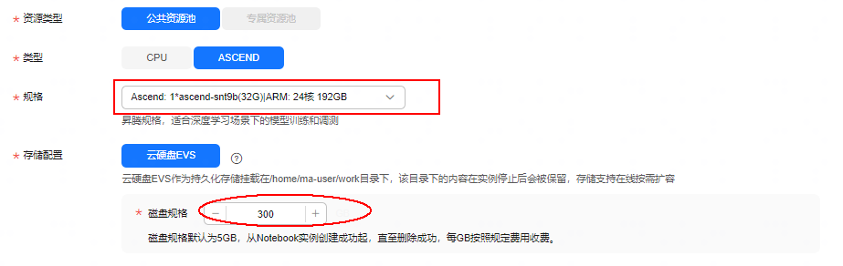
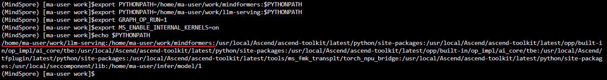

# 推理调优赛题

## 赛题介绍

基于给定数据集及后处理方法，跑通baseline，并对MindFormers中LLaMA2-7b模型进行推理调优，调优算法不限，在精度无损下（对比输出logits的误差，千分之五以内），推理性能相比baseline有提升，对推理总时间进行排名，推理时间越短排名越靠前。

1. 精度无损：此评价方法以对比推理单个token的logits为准，要求偏差在千分之五以内的作品方可视为有效作品，请选手按照官方提供的推理脚本获取特定token的logits，并保存为npy文件，如何获取logits及保存npy文件请参考指导手册-logits文件获取（待更新）

2. 推理总时间：因上述保存logits文件会增加额外耗时，所以建议选手运行两次：一次保存logits文件，一次不进行保存文件操作，仅作推理，推理总时间以后者为准，如何进行两次运行的配置，请参考指导手册-推理时长获取

3. 选手提交作品后，审核老师会检查代码是否包含前处理-推理-后处理全流程，且选手并没有通过如事先保存推理结果文件，然后直接读取文件进行推理等不正当方式缩短推理时间，一经发现有不正当手段即刻取消参赛资格

## 环境准备

本赛题指定使用华为云modelarts-开发环境-notebook环境，使用32G显存的NPU，硬盘规格推荐使用300G，如下图所示设置：



在默认基础环境下，即指定的华为云自定义镜像下，需按照要求额外安装指定的MindSpore和MindFormers依赖。注意，以下的命令强烈建议在终端运行。在安装之前需要手动卸载两个镜像自带的包，卸载命令如下：
```shell
pip uninstall mindformers mindspore-lite
```
MindSpore和MindFormers具体下载链接如下：

MindSpore提供的为whl包，可直接通过以下命令安装：
```shell
wget https://2024-ascend-innovation-contest-mindspore.obs.cn-southwest-2.myhuaweicloud.com/topic2-finetune/mindspore-2.3.0rc2-cp39-cp39-linux_aarch64.whl
pip install mindspore-2.3.0rc2-cp39-cp39-linux_aarch64.whl
```
MindFormers包下载解压，命令及相关链接如下：
```shell
wget https://2024-ascend-innovation-contest-mindspore.obs.cn-southwest-2.myhuaweicloud.com/topic3-infer/mindformers.zip
unzip mindformers.zip
```

 llm-serving包下载解压，命令及相关链接如下：
```shell
wget https://2024-ascend-innovation-contest-mindspore.obs.cn-southwest-2.myhuaweicloud.com/topic3-infer/llm-serving.zip
unzip llm-serving.zip
```

> 注意：MindFormers和llm-serving不用安装，通过wget命令下载到当前目录后，可设置环境变量来直接使用。

环境变量命令如下（环境变量的路径在设置的过程中请注意，以你本地的路径为准）：
```shell
export PYTHONPATH=/home/ma-user/work/mindformers:$PYTHONPATH
export PYTHONPATH=/home/ma-user/work/llm-serving:$PYTHONPATH
export GRAPH_OP_RUN=1
export MS_ENABLE_INTERNAL_KERNELS=on
```
下面两个环境变量也是运行llm-serving需要的，请一起设置。
设置完环境变量之后可通过命令：echo $PYTHONPATH，产看是否设置正确，正确结果如下所示（环境变量中的路径要与你本地文件的路径一致）：



还有另外其他的依赖需要安装，安装命令如下：
```shell
cd llm-serving/
pip install -r requirement.txt
``` 

> 注意：每次notebook重新启动之后都需要重新的卸载自带的mindformers和mindspore-lite包、安装MindSpore、设置环境变量一遍，之前下载过的文件会保留的。

***后续操作详见[2024昇腾AI创新大赛MindSpore赛道实验指导手册](../2024昇腾AI创新大赛MindSpore赛道实验指导手册.pdf)***