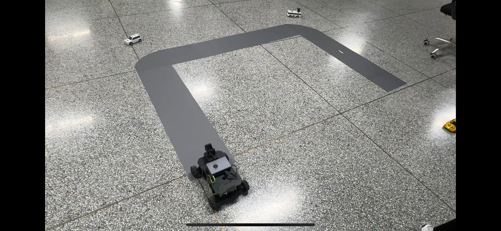

# 🚗 基于 OrangePi AIpro 和鸿蒙系统的智能网联小车开发

## 📝 一、项目信息

### 1️⃣ 项目名称
本项目名称为 **基于 OrangePi AIpro 和鸿蒙系统的智能网联小车开发**。随着无线通信和人工智能技术的快速发展，利用国产开发板及支持鸿蒙系统的移动终端开发智能网联小车，成为了开发者快速利用国产化软硬件技术掌握车联网开发的一种有效手段。本项目使用OrangePi AIpro开发板和高清摄像头搭建智能网联小车，将为智能小车的研究和开发提供重要的实践平台。

### 2️⃣ 方案描述
本项目任务主要包括三部分：  
(1)在华为云平台ModelArts上使用Mindyolo，训练目标识别的模型，并将模型在OrangePi AIpro开发板上进行部署，实现对实时视频流的推理。

(2)使用边缘检测算法提取每一帧图像的边缘信息，实现车道线检测、车道偏移计算等辅助控制功能。

(3)开发鸿蒙应用程序实现控制者通过wifi远程控制智能网联小车运动，并将小车采集的视频数据实时通过wifi传输到鸿蒙终端。远程控制者在终端可以实时观看目标检测、车道保持、车道偏移等结果。

### 3️⃣ 时间规划
- **第一阶段（2025/7/1 - 2025/7/15）**  
  学习目标识别及车道检测算法，准备数据集与开发环境，熟悉 OrangePi AIpro 部署及鸿蒙开发。  

- **第二阶段（2025/7/16 - 2025/8/16）**  
  实现目标检测、车道检测与偏移量计算，并部署算法至 OrangePi AIpro，测试性能并优化。  

- **第三阶段（2025/8/17 - 2025/9/10）**  
  小车组件组装与控制测试，实现 Wi-Fi 远程控制和视频推流。  

- **第四阶段（2025/9/11 - 2025/9/18）**  
  开发鸿蒙终端应用，实现远程控制。  

- **第五阶段（2025/9/19 - 2025/9/28）**  
  小车功能联调与测试，完成结项报告。

---

## 📝 二、已完成工作

### 1️⃣ 目标识别模型训练
- **技术方案**  
  （1）技术方案  
本项目的模型训练基于开源物体检测数据集COCO2017，使用华为云ModelArts训练Mindyolo模型。COCO2017数据集是2017年发布的COCO数据集的一个版本,主要用于COCO在2017年后持有的物体检测任务、关键点检测任务和全景分割任务。COCO2017共包含训练集118287张，验证集5000张，80分类。以下是数据集的目录格式：

    MindSpore 是华为开发的一个全场景AI计算框架，支持端、边、云全场景的 AI 应用开发。MindYOLO作为MindSpore生态的一部分，充分利用了MindSpore 的高性能和灵活性。YOLO系列算法MindYOLO实现了多种YOLO系列算法，包括 YOLOv8、YOLOv7、YOLOX、YOLOv5、YOLOv4和YOLOv3。这些算法在目标检测领域具有广泛的应用，MindYOLO 为这些算法的实现和优化提供了统一的框架。MindYOLO的目标是为研究人员和开发者提供一个灵活且标准化的工具包，以便他们能够重新实现现有的实时目标检测方法，并开发自己的新方法。

- **工作成果**  
  在本次项目中，使用MindYOLO的YOLOv5作为目标识别的模型，以下是YOLO算法的具体实现步骤：  
  （1）划分图像  
  YOLO将输入图像划分为一个固定大小的网格。  

  （2）预测边界框和类别  
  YOLO算法预测出固定数量（通常为5个或3个）的边界框，每个边界框由5个主要属性描述：边界框的位置（中心坐标和宽高）和边界框包含的目标的置信度，以及预测目标的分类结果。  

  （3）单次前向传递  
  YOLO通过一个卷积神经网络（CNN）进行单次前向传递，同时预测所有边界框的位置和类别。相比于其他目标检测算法，YOLO算法只需要一次前向传递即可完成预测，因此具有更快的速度。  

  （4）损失函数  
  YOLO使用多任务损失函数来训练网络，该损失函数包括位置损失、置信度损失和类别损失。其中位置损失衡量预测边界框和真实边界框之间的位置差异。置信度损失衡量边界框是否正确地预测了目标，并惩罚背景框的置信度。类别损失衡量目标类别的预测准确性。  

  （5）非最大抑制  
  在预测的边界框中，可能存在多个相互重叠的框，代表同一个目标。为了消除冗余的边界框，YOLO使用非最大抑制算法，根据置信度和重叠程度筛选出最佳的边界框。  

  YOLO算法的目标检测的速度非常快，标准版本的YOLO可以每秒处理45张图像，YOLO的极速版本每秒可以处理150帧图像。这就意味着YOLO可以小于25毫秒延迟，实时地处理视频。YOLO算法的迁移能力也比较强，可以快速运用到其他新的领域，完成特定需求的目标识别任务。基于以上的特点，可以将训练好的YOLO算法模型部署至边缘计算设备，在适用于所要实现的目标识别任务同时，还保证识别的高实时性和高准确性。  

  （2）工作成果  
  华为ModelArts 是一个一站式的AI开发平台，它提供了从数据准备到模型训练、部署等一系列的功能。下面是使用华为ModelArts的基本步骤：登录华为云控制台，在华为云控制台中，找到“人工智能”分类下的“ModelArts”服务，点击ModelArts图标进入ModelArts控制台。ModelArts需要使用华为云的对象存储服务（OBS）来存储数据集。在ModelArts控制台中，选择“数据管理”，然后点击“创建OBS桶”。  

  由于容量限制，以下是在OBS Browsers+中创建的数据集：  

  在NoteBook中打开JupyterLab，将数据集和代码文件解压，执行训练文件。  
  训练结束后，调用mindyolo开发套件的export接口进行模型转换，将训练好的ckpt文件转为onnx模型文件。然后针对OrangePi AIpro板卡，在ATC转换模型完成后，即可得到适用于模型推理的om模型文件。

### 2️⃣ 车道线检测
- **技术方案**  
  边缘检测算法是图像处理中用于识别图像中物体边界的关键技术，主要包括Canny、Sobel、Prewitt、Laplacian等经典方法。‌其中，因为‌Canny算子低错误率、高定位精度和双阈值处理等特点，‌Canny算子被认为是最优且最常用的边缘检测算。因此，在本次项目中的车道线检测使用‌Canny边缘检测算法，它能够通过提取每一帧图像的边缘信息，准确地检测到图像中的边缘，以突出最可能的车道线轮廓，同时过滤掉边缘检测图像中非车道部分的边缘信息，从而集中检测车辆前方的车道线。  

  以下是Canny边缘检测算法的具体构成：  
  （1）灰度化处理  
  将输入的彩色图像转换为灰度图像。  

  （2）高斯滤波  
  使用高斯滤波器对灰度图像进行平滑处理，以减少噪声的影响。  

  （3）计算图像梯度  
  使用Sobel算子计算灰度图像在水平和垂直方向的梯度值，从而得到每个像素点的梯度强度和方向。  

  （4）非极大值抑制  
  对于每个像素点，比较其梯度方向上的邻近两个像素点之梯度值的大小，只保留梯度方向上梯度值极大的像素点，有利于消除边缘上的模糊效果。  

  （5）双阈值处理  
  将像素点分为三类：强边缘、弱边缘和非边缘。当像素点的梯度值高于较高的阈值时，将其分类为强边缘；低于较低的阈值时，分类为非边缘；介于两者之间的分类为弱边缘。  

  （6）弱边缘与强边缘连接  
  将弱边缘像素点与强边缘像素点相连接，形成完整的边缘轮廓。  

- **工作成果**  
  根据Canny算子提取的边缘图像，在感兴趣区域（ROI）内使用概率霍夫直线变换检测左右车道线，并通过最近几帧车道线队列平滑，最终绘制稳定车道线，实现车道线检测功能。

### 3️⃣ 车道偏移量计算
- **技术方案**  
  车道偏移量计算是根据左右车道线位置估计车道中心位置，并计算车道中心与车辆图像中心的偏差。偏移量的正负值表示车辆偏离车道中心的方向。  

- **工作成果**  
  根据计算的偏移量，控制智能车做出相应调整（左微调AL、右微调AR、直行F），并通过UDP协议将偏移量发送到鸿蒙终端，实现车道保持功能。

### 4️⃣ OrangePi AIpro 模型部署
- **技术方案**  
  推理流程：  
  1. 输入预处理：将图像进行letterbox缩放，BGR→RGB，HWC→CHW，数据类型转换为float32。  
  2. 调用`InferSession.infer()`进行推理。  
  3. 后处理：解析预测框坐标，进行NMS（非极大抑制），映射回原图坐标。  
  4. 可视化：使用PIL在图像上绘制边框和类别标签。  
  5. 结果发送：通过UDP发送JSON数据给终端。  

  模型转换过程：MindYOLO ckpt → ONNX → ATC → OM。YoloV5类继承基础Model类，实现前处理、推理、后处理等方法。NPU运行低延迟，适合边缘计算。  

- **工作成果**  
  成功在OrangePi AIpro上运行YOLO模型，实现行人、小汽车等目标检测，并通过UDP发送检测结果，实现实时反馈。

### 5️⃣ 鸿蒙终端 UI 界面开发
- **技术方案**  
  使用 DevEco Studio + ArkTS 语言开发上位机界面，ArkTS支持声明式UI、状态管理和静态类型，适合高性能HarmonyOS应用开发。  

- **工作成果**  
  界面功能模块包括：  
  1. 运动控制（前进/后退/左转/右转）  
  2. 舵机控制（左右/上下）  
  3. 速度调节（高/中/低）  
  4. 视频回传  
  5. 信息交互（UDP文字显示）

### 6️⃣ 智能网联车构造设计和模拟沙盘
- **技术方案**  
  - 轻量化、模块化车体设计  
  - 双层亚克力车体、舵机调节摄像头、OrangePi AIpro主控  
  - 四轮差速驱动，麦克纳姆轮，低重心稳定  
  - 沙盘道路用灰色贴纸铺设，放置人形和车辆模型模拟复杂交通环境  

- **工作成果**  
 -整体搭建过程中，各功能模块通过标准化接口和螺栓固定，保证了小车结构的可维护性与可扩展性。同时，车体表面留有足够空间，以便后续安装5G通信模块、额外传感器或散热装置，从而满足不同实验场景的需求。
- 本次实验搭建了一个供智能网联小车行驶的模拟沙盘。整体线路由灰色贴纸铺设而成，用以模拟实际道路环境，保证小车能够按照既定路线稳定行驶。在道路两侧布置了人形与车辆模型，模拟真实交通场景中的行人和过往车辆，以增加环境复杂性和测试真实性。通过该沙盘环境，小车在运行过程中不仅能够进行基本的行进和转向控制，还能够结合目标识别、车道线检测等功能实现对“行人”和“车辆”的识别与行驶指令发送，从而验证智能网联技术在真实道路条件下的应用效果。以下是实验场景图：

---

## ⚠️ 三、遇到的问题及解决方案
1. MindYOLO模型ONNX导出：SiLU算子不被支持 → 参考HiAscend文档处理。  
2. AscendCL接口端侧推理：未初始化AscendCL导致资源错误 → 调用资源前先初始化，并在推理结束后释放资源。  
3. 智能车实时视频推流延迟：HTTP请求-响应模式导致延迟高 → 降低分辨率/帧率，使用局域网，多线程或异步共享视频帧。  
4. 鸿蒙控制界面开发问题：ArkTS框架、网络通信、性能优化 → 使用声明式UI、WebSocket通信、异步解耦界面逻辑。

---

## 🚀 四、后续工作安排
1. 多传感器融合：增加激光雷达、超声波传感器，实现精确测距和近距离障碍物检测。  
2. 自动驾驶辅助功能：自动巡航、自动刹车/避障。  
3. 智能路径规划与导航：全局路径规划+局部避障。  
4. 远程监控与控制：小车端与云端通信模块，实时视频流、状态数据和手动控制界面。
