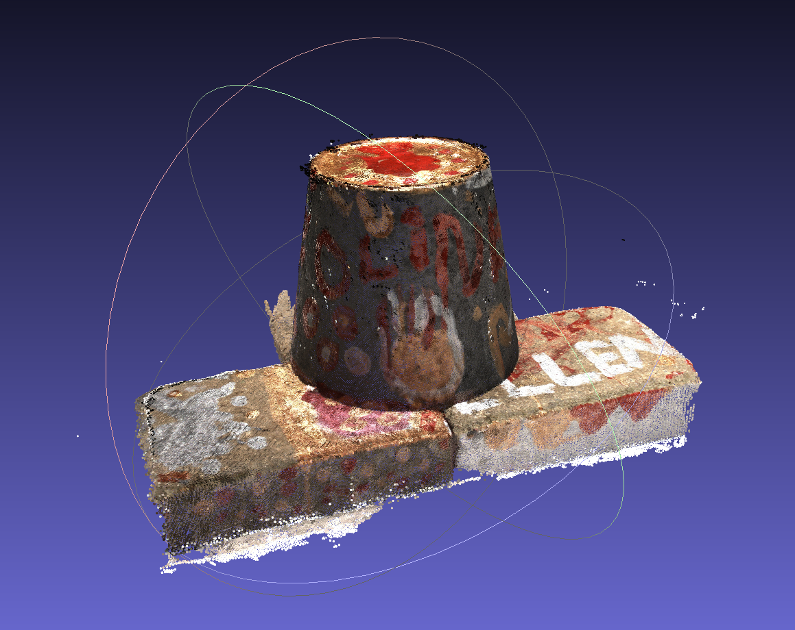
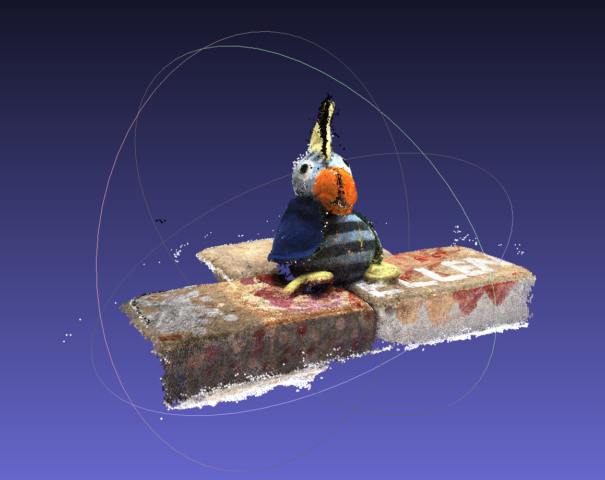
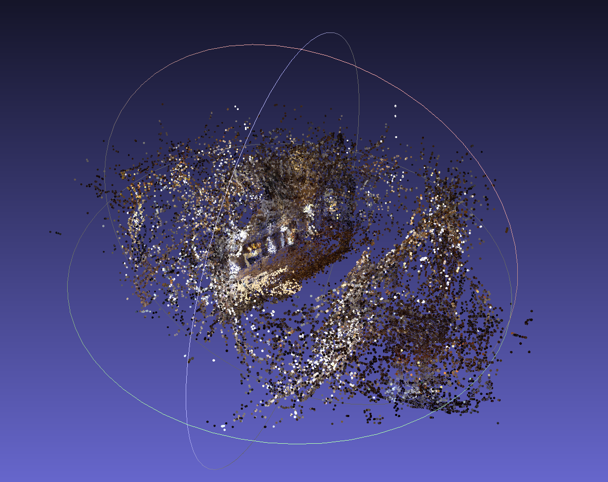

# An Unofficial Mindspore Implementation of MVSNet

[MVSNet: Depth Inference for Unstructured Multi-view Stereo](https://arxiv.org/abs/1804.02505). Yao Yao, Zixin Luo, Shiwei Li, Tian Fang, Long Quan. ECCV 2018.

 MVSNet 是一个基于深度学习的利用多视角图像信息重建每个视角深度图并融合出场景三维信息的方法，是基于深度学习的MVS方法的开山之作。这个仓库是使用Mindspore框架实现MVSNet的非正式代码。

另外仓库提供了另一基于多尺度的方法CasMVSNet的mindspore框架下的代码。

## How to Use

### Environment
* cuda11.6
* python 3.9.23
* mindspore 2.2.14 
* numpy 1.26.4 
* opencv-python-headless
* plyfile

### Training

* 可转化pytorch权重为mindspore权重，
* 下载处理好的DTU训练数据集 [DTU training data](https://drive.google.com/file/d/1eDjh-_bxKKnEuz5h-HXS7EDJn59clx6V/view) (来自 [Original MVSNet](https://github.com/YoYo000/MVSNet))，解压为 ``MVS_TRANING`` 文件夹。在云端可使用OBS脚本`installDTUTraining.py`获得该训练数据集。
* 同时也可以使用华为云OBS获得训练数据集：
  * https://dtu-train-mvsnet.obs.cn-north-4.myhuaweicloud.com/Depths_raw.zip
  * https://dtu-train-mvsnet.obs.cn-north-4.myhuaweicloud.com/dtu.zip
  * https://dtu-train-mvsnet.obs.cn-north-4.myhuaweicloud.com/dtu_training.rar
* 测试的DTU输出结果参考：
	* https://dtu-train-mvsnet.obs.cn-north-4.myhuaweicloud.com/MVSNetMindSpore_outputs.zip

* 在 ``train.sh``脚本中设置 ``MVS_TRAINING`` 为上一个训练文件夹路径。并创建一个 ``checkpoints``文件夹。
* 运行 ``./train.sh``，在GPU3090上训练16个epoch，batchsize为2，大概需要7天。

### eval&Fusion

* 下载处理好的DTU测评数据集 [DTU testing data](https://drive.google.com/open?id=135oKPefcPTsdtLRzoDAQtPpHuoIrpRI_) (来自 [Original MVSNet](https://github.com/YoYo000/MVSNet)) 解压并保存为`DTU_TESTING` 文件夹，文件夹中包含 ``cams`` ， ``images`` ，``pair.txt`` 三个文件
* 在``eval.sh``脚本中设置 ``DTU_TESTING`` 为测评数据集路径，设置 ``CKPT_FILE`` 为权重。你也可以使用在仓库中的权重，因为他体积很小，所以直接保存在仓库中。
* 运行`sh eval.sh`，注意查看`eval.py`中解注释，先生成每个参考视角深度图，然后将深度图融合为点云。
* 针对TanksAndTemples数据集，遵循IterMVSNet中对TanksAndemples的数据处理，同理运行``test_tank.sh``可评估。

## DTU数据集定量评估结果

按照[Fast DTU Evaluation Using GPU with Python](https://github.com/Gwencong/Fast-DTU-Evaluation)仓库中描述，下载真实点云数据，然后将预测点云和真实点云路径修改到评估脚本。
D为深度采样数，采样约密集，评估指标表现越好，需根据显存设置。

|                         | Acc.   | Comp.  | Overall. |
| ----------------------- | ------ | ------ | -------- |
| MVSFormer++             | 0.3090 | 0.2521 | 0.2805   |
| MVSNet(D=256)           | 0.396  | 0.527  | 0.462    |
| PyTorch-MVSNet(D=192)   | 0.4492 | 0.3796 | 0.4144   |
| Mindspore-MVSNet(D=192) | 0.4456 | 0.4102 | 0.4279   |

评估完整结果如下

~~~shell
set the max number of processes used to 12
			acc.(mm):0.2411, comp.(mm):0.2816, overall(mm):0.2614
			acc.(mm):0.2686, comp.(mm):0.3966, overall(mm):0.3326
			acc.(mm):0.4430, comp.(mm):0.4039, overall(mm):0.4234
			acc.(mm):0.2699, comp.(mm):0.2674, overall(mm):0.2686
			acc.(mm):0.4333, comp.(mm):0.4525, overall(mm):0.4429
			acc.(mm):0.3632, comp.(mm):0.2764, overall(mm):0.3198
			acc.(mm):0.3476, comp.(mm):0.5457, overall(mm):0.4466
			acc.(mm):0.4207, comp.(mm):0.3757, overall(mm):0.3982
			acc.(mm):0.4218, comp.(mm):0.4358, overall(mm):0.4288
			acc.(mm):0.3458, comp.(mm):0.4125, overall(mm):0.3792
			acc.(mm):0.6892, comp.(mm):0.7285, overall(mm):0.7089
			acc.(mm):0.5250, comp.(mm):0.3976, overall(mm):0.4613
			acc.(mm):0.4564, comp.(mm):0.4392, overall(mm):0.4478
			acc.(mm):0.2878, comp.(mm):0.3288, overall(mm):0.3083
			acc.(mm):0.5180, comp.(mm):0.5748, overall(mm):0.5464
			acc.(mm):0.5543, comp.(mm):0.5546, overall(mm):0.5545
			acc.(mm):0.4948, comp.(mm):0.4066, overall(mm):0.4507
			acc.(mm):0.7288, comp.(mm):0.3209, overall(mm):0.5249
			acc.(mm):1.0683, comp.(mm):0.4738, overall(mm):0.7710
			acc.(mm):0.3693, comp.(mm):0.3060, overall(mm):0.3376
			acc.(mm):0.2527, comp.(mm):0.2720, overall(mm):0.2623
			acc.(mm):0.3028, comp.(mm):0.3738, overall(mm):0.3383
mean acc:      0.4456
mean comp:     0.4102
mean overall:  0.4279
~~~

~~~ shell
# Barn
accuracy_mean: 18.491276
completeness_mean: 18.171222
# Church
accuracy_mean: 1.364507
completeness_mean: 13.370695
# Caterpillar
accuracy_mean: 154.720557
completeness_mean: 147.039967
# Courthouse
accuracy_mean: 31.292231
completeness_mean: 55.036630
# Ignatius
accuracy_mean: 6.646028
completeness_mean: 2.393079
# Meetingroom
accuracy_mean: 5.655393
completeness_mean: 11.323320
# Truck
accuracy_mean: 7.807837
completeness_mean: 2.217363
~~~
## DTU重建效果展示

## TanksAndTemples

