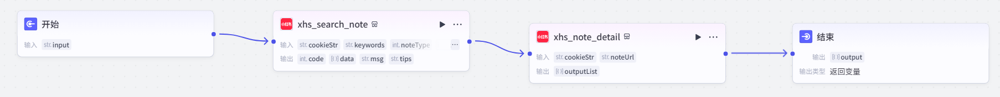
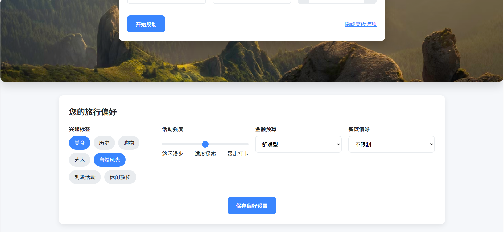
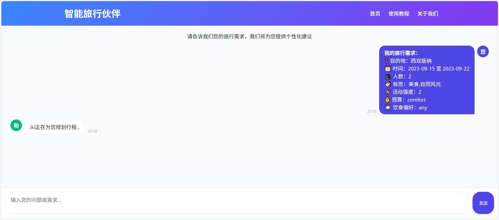
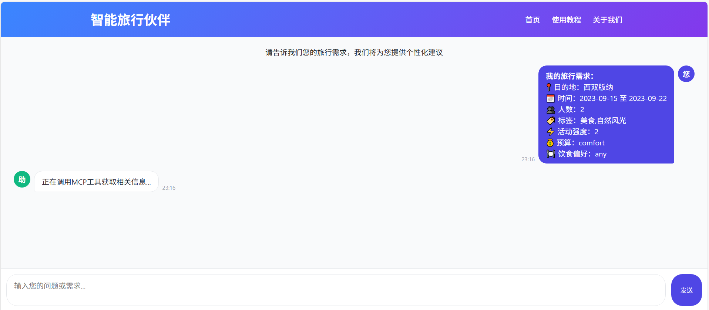

## 项目描述
基于模型上下文协议（MCP）整合用户偏好、实时交通/天气数据、景点热度、消费成本等多源信息，并结合 SOTA模型（如Qwen3等）实现个性化行程生成、动态路线优化及体验模拟。

## 项目要求
1. 集成来自交通、天气、景点等多个开放API的实时数据，对多源数据及进行预处理和融合 
2. 基于MindSpore，采用SOTA的多模态大语言模型，实现对用户偏好和多源信息的理解和处理，提供初步行程建议和路线规划 
3. 采用策略梯度的强化学习算法（如PPO），实现动态路线优化 
4. 开发交互式用户界面，展示个性化行程和路线规划结果，提升用户体验

## 版本要求
* python>=3.9 
* MindSpore>=2.6

## 项目进度
- 已完成获取天气、交通、酒店、景点、小红书旅游帖子、经纬度、美食等MCP工具的开发
- 已完成ppo基于景点间距离、景点评分和花费，实现动态路线优化
- 已完成文字、图片等多源信息的旅游攻略生成开发
- 已完成vue3+flask的前后端分类的用户友好型web开发
- 已完成基本测试

## 项目开发环境
- 镜像环境： mindspore_2.4.10-cann_8.0.0-py_3.10-euler_2.10.11-aarch64-snt9
- 实例规格：Ascend: 2*ascend-d910b|CPU: 48核 384GB
- Ascend-cann-nnae_8.0.0_linux-aarch64
- Ascend-cann-kernels-910b_8.0.0_linux-aarch64.run
- python 库
  - mindspore  == 2.4.10
  - transformers==4.39.2
  - torch==2.4.0
  - accelerate==0.24.1
  - mcp == 1.15.0
  - transformers-stream-generator==0.0.5
  - torch_npu==2.4.0
  - stable-baselines3
  - gymnasium
  - sb3-contrib
- vite == 7.1.2
- vue@3.5.21
  - @rollup/rollup-win32-x64-msvc == 4.50.1
  - @types/node == 24.5.2
  - @types/vue-router == 2.0.0
  - @vitejs/plugin-vue == 6.0.1
  - @vue/tsconfig == 0.7.0
  - typescript ~= 5.8.3

## 项目方案
### MCP工具开发
- 获取指定地点景点列表：利用高德地图的地点检索API， 5000次/月
- 获取指定景点附近的酒店：利用百度地图的地点检索API，100次/天
- 获取小红书上相关的旅游帖子作为参考：在coze中利用小红书插件搭建工作流并使用API
- 获取两地之间的步行/骑行/驾车/公共交通路线：利用百度地图的路径规划API，30000次/天
- 获取指定地区的天气情况：利用百度地图天气API，300000次/天
- 获取指定地点的经纬度（用于路径规划）：利用百度地图地理编码API，5000次/天
- 获取指定地点附近的美食：利用百度地图地点检索服务，通过美食相关关键字进行检索，100次/天

其中，百度地图和高德地图均需要在对应的开发者平台进行注册申请并替换相应的密钥。

获取小红书上相关的旅游帖子在coze中搭建的工作流样式为


### 强化学习

1. 状态空间

定义了智能体可观察到的环境信息，包含：

```python
self.observation_space = spaces.Box(
    low=0, 
    high=100, 
    shape=(max_attractions * 3 + 7,),  # 维度：景点数*3 + 7个额外特征
    dtype=np.float32
)
```
具体观察内容（在`_get_obs`中定义）：

- 已访问景点标记（`self.visited`）
- 当前位置的独热编码（`current_pos_onehot`）
- 每个景点成本与剩余预算的比例（`cost_ratio`）
- 步数、剩余需访问景点数、总距离、总花费等辅助信息

2. 动作空间（Action Space）

定义了智能体可执行的动作：

```python
self.action_space = spaces.Discrete(max_attractions + 1)
```

- 动作`0 ~ max_attractions-1`：选择访问对应的景点
- 动作`max_attractions`：终止行程（只有达到最少访问数后才有效）

3. 奖励机制

- **基础奖励**：访问景点获得固定奖励（8 分）+ 景点评分奖励（评分 ×3）
- **惩罚项**：距离惩罚（距离 ×0.3）+ 超预算惩罚（超支部分 ×0.1）
- 激励项：
  - 开始行程奖励（15 分）
  - 达到最少访问数奖励（200 分）
  - 探索未访问景点奖励（未访问数 ×0.3）
  - 完成所有景点奖励（100 分）
- **终止奖励**：综合考虑访问数量、总评分、总距离和花费

4. 算法训练

采用200组景点数量为10-25的随机生成的景点数据进行训练

### 用户友好界面开发
采用vue3进行前端界面的开发，首页支持用户填写地点、时间、人数、兴趣偏好、预算类型、活动强度等信息，聊天页支持查看旅游攻略生成结果并进行继续聊天。
采用flask框架进行python后端接口的开发，分步骤返回方案生成状态。

## 效果与测试

### 首页效果

在旅游规划系统的首页，目的地、日期和人数为必填项。

点击“设置更多偏好？”，可以进行一些更细致的个人偏好设置，如兴趣标签、活动强度等。

填写并保存好旅行信息和个人偏好后，点击“开始规划”按钮即可跳转到对话界面。

### 3.2 对话页面

进入对话界面，首先会展示用户设置的偏好取消，然后AI助手会实时返回后端接口处理步骤，如调用MCP工具、强化学习动态规划、生成旅行方案等。





### 3.3 方案生成效果测试

方案包括每天的详细计划、包括景区的详细信息、图片、天气、景区间的交通方式和对应推荐等信息，用一种用户友好的方式进行展现。

.png)

### 3.4 动态规划、自由对话效果测试

会根据用户的需求进行动态调整，而且会动态考虑天气、交通等情况。

.png)