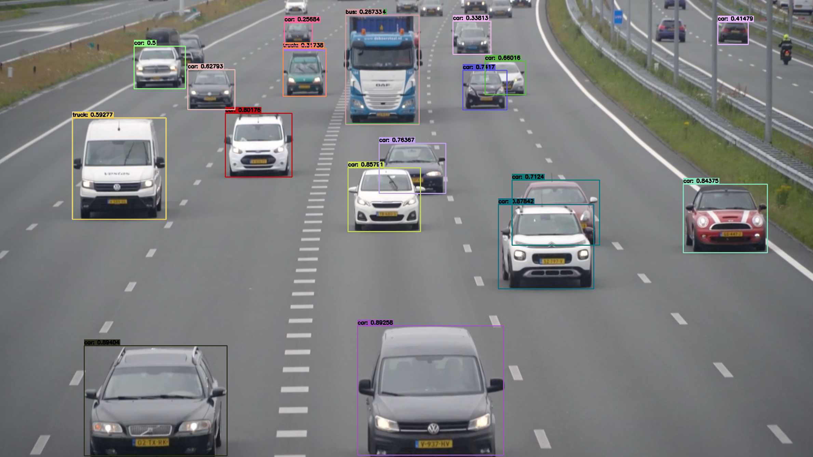
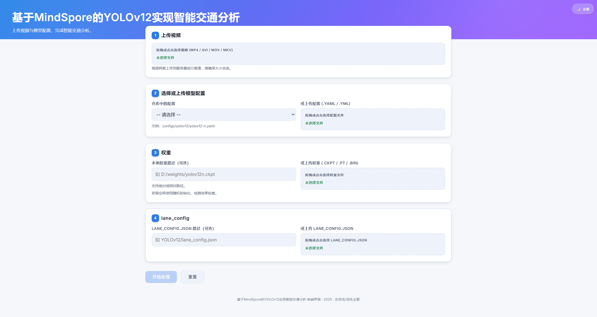
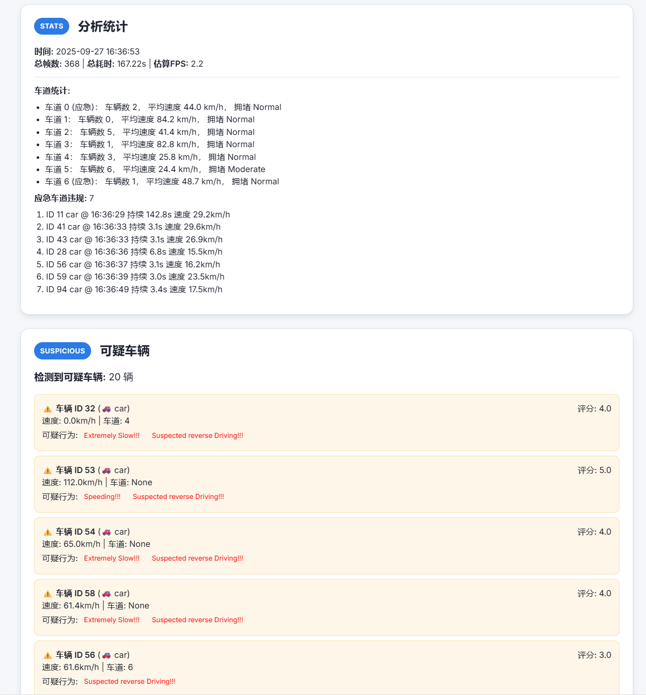
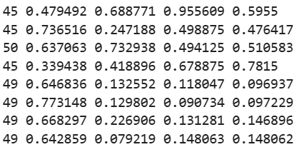
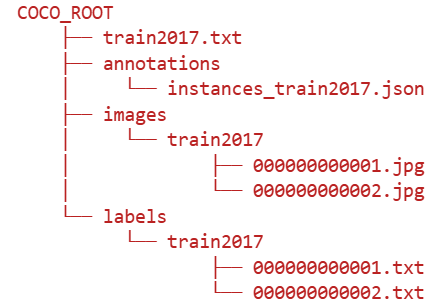

# 基于MindSpore的YOLOv12实现智能交通分析

## 项目产出要求

+ 基于MindSpore框架和套件，**迁移YOLOv12模型**，精度性能达到论文水平。
+ 基于YOLOv12模型，完成一个交通安全的案例应用：**检测紧急车道违规并识别阻碍紧急车辆的车辆**；**分析基于车道的交通流速和拥堵情况**，以确定交通状况；**对车辆进行计数并对类型进行分类**，以提供有关不同车辆类型的数据。
+ 完成以下功能模块的开发：
  + `LaneDetector`类：①**加载多边形数据**：从JSON文件中读取泳道区域并缩放它们以匹配视频分辨率。②**确定泳道位置**：使用其边界框检查检测到的车辆是否在车道内。③**跟踪车辆数量和速度**：计算车辆数量并计算每条车道的平均速度。
  + `LaneVehicleProcessor`类：①**集成YOLO和ByteTrack**：YOLO检测车辆，而 ByteTrack 跨帧跟踪它们。②**分析检测区域**：将检测到的车辆与预定义的车道区域进行比较。③**显示流量数据**：使用`OpenCV`和`Supervision`库在视频上叠加实时数据。
  + 流量管理：①**入口和出口区域**：跟踪车辆进出的车道。②**速度估计**：为车辆分配随机但真实的速度值。③**紧急车道警告**：检测应急车道上的车辆并发出警告。

## 模型迁移

项目基于MindSpore框架和Mindyolo项目复现了YOLOv12模型，使用与论文相同的参数，在COCO数据集下进行验证的结果如表1所示。

<p align="center">表1 YOLOv12验证结果（单位：%）</p>

|          | $AP_{50:95}^{val}$ | $AP_{75}^{val}$ | $AP_{95}^{val}$ | $AP_{samll}^{val}$ | $AP_{medium}^{val}$ | $AP_{large}^{val}$ |
| :------: | :----------------: | :-------------: | :-------------: | :----------------: | :-----------------: | :----------------: |
| YOLOv12n |        39.6        |      55.6       |      43.0       |        19.3        |        43.9         |        57.4        |
| YOLOv12s |        47.0        |      64.2       |      50.7       |        29.1        |        51.9         |        64.5        |
| YOLOv12m |        51.9        |      69.6       |      54.3       |        35.5        |        57.0         |        68.2        |
| YOLOv12l |        53.4        |      71.0       |      58.0       |        35.7        |        58.9         |        70.1        |

使用YOLOv12s进行模型推理，结果如图1所示。



<p align="center">图1 YOLOv12s推理结果</p>

## 智能交通分析
智能交通分析演示：


项目使用`HTML+CSS+JavaScript`作为前端，Python的`flask`库作为后端进行web界面开发，前端界面主要包含两个：一个是上传视频及参数选择界面，如图2所示，另一个是检测结果界面，如图3，4所示。



<p align="center">图2 前端上传视频及参数选择界面</p>


<p align="center">图3 前端推理结果界面1</p>



<p align="center">图3 前端推理结果界面2</p>

## 所使用的MindSpore组件

**1.mindspore.nn**

用于构建神经网络中的预定义构建块或计算单元。在`AAttn`, `ABlock`, `A2C2f`模块以及YOLOv12模型的代码中，都使用了`nn`组件来搭建网络，其中使用的最多的是：

```python
nn.Cell # 所有神经网络层的基类，构建网络结构都需要继承该类
nn.CellList # 用于包装多个Cell的容器
nn.SequentialCell #同于顺序执行多个Cell的容器
nn.Conv2d #2D卷积层
Parameter #可训练参数
```

**2.mindspore.ops**

mindspore.ops提供了大量的function接口，包括神经网络函数、数学运算函数、Tensor操作函数、Parameter操作函数、微分函数等。在`AAttn`, `ABlock`, `A2C2f`模块以及YOLOv12模型的代码中，使用的最多的`ops`算子是：

```python
# 基础算子
ops.concat    # 张量拼接
ops.split    # 张量分割
ops.transpose  # 张量转置
ops.reshape   # 张量形状变换
ops.matmul    # 矩阵乘法

# 数学运算
ops.exp     # 指数运算
ops.Sigmoid   # Sigmoid激活
ops.softmax   # Softmax激活
ops.ones     # 创建全1张量

# 归约操作
ops.ReduceMax  # 最大值归约
ops.ReduceSum  # 求和归约
```

**3.mindspore.Tensor及mindspore.tensor**

Tensor张量，即存储多维数组（n-dimensional array）的数据结构。tensor接口用于在Cell.construct()或者@jit装饰的函数内，创建一个新的Tensor对象。在`AAttn`, `ABlock`, `A2C2f`模块以及YOLOv12模型的代码中，使用的最多的是：

```python
Tensor(data, dtype)  # 创建张量
tensor.shape         # 获取张量形状
tensor.view()        # 改变张量形状
tensor.flatten()     # 张量扁平化
tensor.swapaxes()    # 交换轴
```

**4.mindspore.common.initializer**

初始化神经元参数。在`AAttn`, `ABlock`, `A2C2f`模块以及YOLOv12模型的代码中，使用了：

```python
initializer()           # 参数初始化器
TruncatedNormal()      # 截断正态分布初始化
Constant()             # 常数初始化
```

**5.核心框架组件**

在训练和测试代码中，使用了`mindspore`的核心组件，这些组件主要包含了`mindspore.set_context`, `mindspore.set_recursion_limit`以及`mindspore.set_device`：

```python
ms.set_context(mode=args.ms_mode)  # GRAPH_MODE(0) 或 PYNATIVE_MODE(1)
ms.set_context(jit_config={"jit_level": "O2"})  # JIT编译优化
ms.set_recursion_limit(2000)  # 递归深度限制
ms.set_device("Ascend", device_id)  # 设备选择
```

**6.并行计算组件**

在训练和测试代码中，使用了`mindspore.communication`以及`mindspore.set_auto_parallel_context`等分布式计算组件：

```python
from mindspore import ParallelMode
from mindspore.communication import init, get_rank, get_group_size

# 分布式初始化
init()
args.rank, args.rank_size = get_rank(), get_group_size()
ms.set_auto_parallel_context(device_num=args.rank_size, parallel_mode=ParallelMode.DATA_PARALLEL)
```

**7.自动混合精度**

在训练和测试代码中，使用了`mindspore.amp`这个自动混合精度组件：

```python
ms.amp.auto_mixed_precision(network, amp_level=args.ms_amp_level)  # O0/O1/O2/O3
ms.amp.auto_mixed_precision(loss_fn, amp_level="O0" if args.keep_loss_fp32 else args.ms_amp_level)
```

**8.训练及数据处理组件**

在训练和测试代码中，使用了训练及数据处理组件：

```python
ms.dataset.ConcatDataset(stage_dataloaders)  # 数据集拼接
ms.dataset.Dataset # MindSpore的数据集类，用于加载和处理数据
ms.data.Albumentations # 数据增强库
ms.dataset.create_dict_iterator #创建数据集的字典迭代器，用于逐批获取数据
nn.SGD/nn.Momentum #优化器，用于更新模型参数
optimizer.parameters #获取优化器管理的参数
ops.clip_by_global_norm #用于防止梯度爆炸，通过裁剪梯度的全局范数
mindspore.utils.callback #回调函数
mindspore.utils.checkpoint_manager.CheckpointManager #管理模型权重的保存和加载
```

## 快速开始本项目

### 模型迁移

**1.数据集预处理及准备**

准备好COCO2017数据集，首先将其转换为YOLO格式，如图4所示；然后将数据集按照如图5所示的文件结构放置。

<p align="center">

</p>
<p align="center">图4 YOLO数据集格式</p>

<p align="center">

</p>
<p align="center">图5 数据集文件放置形式</p>

**2.环境准备**

使用单卡或多卡Ascend: 8*ascend-d910b，要求Python>=3.9，mindspore>=2.6 ，然后使用运行`pip install -r requirements.txt`安装相应的包即可。

**3.模型训练**

单卡：

```shell
python train.py --config ./configs/yolov12/yolov12-n.yaml 
```

多卡：

```shell
msrun --worker_num=8 --local_worker_num=8 --bind_core=True --log_dir=./yolov12_log python train.py --config ./configs/yolov12/yolov12-n.yaml --device_target Ascend --is_parallel True
```

**4.模型推理**

```shell
python predict.py --config ./configs/yolov12/yolov12-n.yaml --weight=/path_to_ckpt/WEIGHT.ckpt --image_path /path_to_image/IMAGE.jpg
```

**5.模型验证及测试**

单卡：

```shell
python test.py --config ./configs/yolov12/yolov12-n.yaml --weight /path_to_ckpt/WEIGHT.ckpt
```

多卡：

```shell
msrun --worker_num=8 --local_worker_num=8 --bind_core=True --log_dir=./yolov12_log python test.py --config ./configs/yolov12/yolov12-n.yaml --weight /path_to_ckpt/WEIGHT.ckpt --is_parallel True
```

### 使用智能交通分析页面
智能交通分析演示：
+ 车道`json`文件按照以下格式准备，`video_width`和`video_height`指原视频的宽高，`points`的四个坐标分别是车道区域的左下、左上、右上、右下方向，`is_emergency`为`true`代表为紧急车道。

```c++
{
  "video_width": 1920,
  "video_height": 1080,
  "lanes": [
    {
      "id": 0,
      "points": [
        [0,150],
        [400,0],
        [480,0],
        [0,250]
      ],
      "is_emergency": true
    },
    {
      "id": 1,
      "points": [
        [0,250],
        [480,0],
        [510,0],
        [0,400]
      ],
      "is_emergency": false
    },
    {
      "id": 2,
      "points": [
        [0,400],
        [510,0],
        [560,0],
        [50,750]
      ],
      "is_emergency": false
    },
    {
      "id": 3,
      "points": [
        [50,750],
        [560,0],
        [630,0],
        [350,1080]
      ],
      "is_emergency": false
    },
    {
      "id": 4,
      "points": [
        [350,1080],
        [630,0],
        [700,0],
        [960,1080]
      ],
      "is_emergency": false
    },
    {
      "id": 5,
      "points": [
        [960,1080],
        [700,0],
        [750,0],
        [1500,1080]
      ],
      "is_emergency": false
    },
    {
      "id": 6,
      "points": [
        [1500,1080],
        [750,0],
        [850,0],
        [1920,900]
      ],
      "is_emergency": true
    }
  ]
}
```

+ 根据需求修改`traffic_flow_manager.py`中`estimate_realistic_speed`的`base_speeds`变量。

+ 执行`python web.py`，上传视频、选择车道`json`文件、模型配置`yaml`文件及权重`ckpt`文件即可。

### 可能出现的问题

+ 问题一：在进行模型验证时报错`ModuleNotFoundError: No module named 'pycocotools._mask'`

  解决方案：这个错误是由于安装`pycocotools`包时其缺少了`_mask`这个API导致的报错，需要手动解决。以下是基于Linux系统的解决方案：

(1)首先需要去github上下载COCOAPI，git指令为：

```shell
git clone https://github.com/cocodataset/cocoapi.git
```

(2)下载好之后需要进到PythonAPI文件夹，运行指令：

```shell
cd cocoapi/PythonAPI
```

(3)进入文件夹之后，执行以下两条指令：

```shell
python setup.py build_ext --inplace
python setup.py build_ext install
```

重新运行验证代码，就能够解决报错。

+ 问题二：在进行模型验证时报错`module 'numpy' has no attribute 'float'`

  解决方案：这是环境安装的`numpy`包太新导致的，新版本的`numpy`已经删除了`'float'`属性，需要使用旧版本的`numpy`，使用1.23.5版本的numpy即可解决这个错误，执行指令：

```shell
pip install -U numpy==1.23.5
```

+ 问题三：在前端推理界面时加载视频失败

  解决方案：这是由于浏览器和`OpenCV`对视频的编码格式不一致导致的，需要将推理后的视频转换为H.264编码格式浏览器才能正常加载视频，转换的工具项目使用的是`ffmpeg`，注意安装`ffmpeg`的指令应该使用`conda install ffmpeg`，使用`pip install ffmpeg`无法正常安装该包。