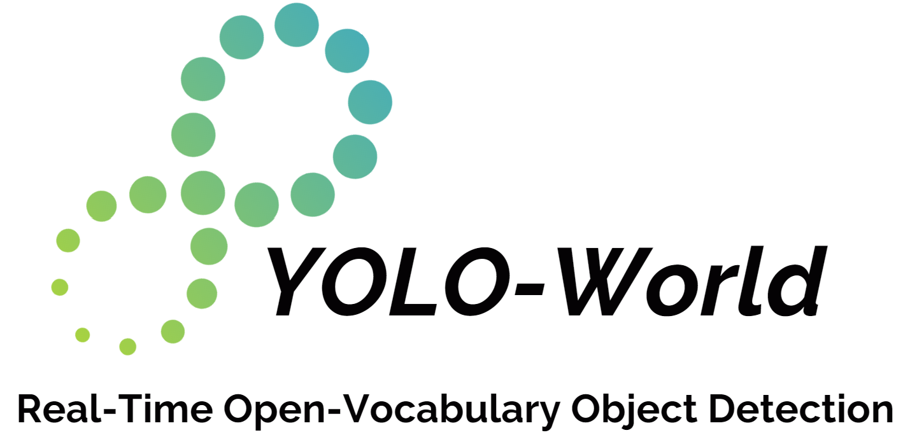

<a id="readme-top"></a>

<!-- [![Contributors][contributors-shield]][contributors-url]
[![Forks][forks-shield]][forks-url]
[![Stargazers][stars-shield]][stars-url]
[![Issues][issues-shield]][issues-url]
[![MIT License][license-shield]][license-url]
[![LinkedIn][linkedin-shield]][linkedin-url] -->


<!-- PROJECT LOGO -->
<br />
<div align="center">
  <a href="https://github.com/ttaohe/competition">
    
  </a>

  <h3 align="center">MindSpore Implementation of YOLO-World V2 with Inference and Testing</h3>

  <p align="center">
    <a href="https://github.com/ttaohe/competition"><strong>HUAWEI AI Gallery Demo »</strong></a>


  </p>
</div>


<!-- TABLE OF CONTENTS -->
<details>
  <summary>Table of Contents</summary>
  <ol>
    <li>
      <a href="#about-the-project">About The Project</a>
    </li>
    <li>
      <a href="#getting-started">Getting Started</a>
      <ul>
        <li><a href="#prerequisites">Prerequisites</a></li>
        <li><a href="#installation">Installation</a></li>
      </ul>
    </li>
    <li><a href="#contact">Contact</a></li>
  </ol>
</details>


<!-- ABOUT THE PROJECT -->
## About The Project

This project involves the successful porting of the YOLO-World model to the MindSpore framework, along with the development of an AI Gallery demo.

<p align="right">(<a href="#readme-top">back to top</a>)</p>


<!-- GETTING STARTED -->
## Getting Started

This section provides detailed instructions on setting up the YOLO-World V2 model in MindSpore for inference and testing.


### Installation

Follow these steps to install and set up the YOLO-World V2 model:

**1. clone the repository**
```bash
git clone https://github.com/ttaohe/competition.git
cd competition/summer-ospp2024
```
**2. conda environment setup**
```bash
conda create -n yolo-world-v2 python=3.9
conda activate yolo-world-v2
```
**3. MindSpore Installation**

For example, mindspore-2.2.14-linux-x86_x64 for python-3.9 installation by using pip, otherwise, please refer to the [official website](https://www.mindspore.cn/install/).
```bash 
pip install https://ms-release.obs.cn-north-4.myhuaweicloud.com/2.2.14/MindSpore/unified/x86_64/mindspore-2.2.14-cp39-cp39-linux_x86_64.whl --trusted-host ms-release.obs.cn-north-4.myhuaweicloud.com -i https://pypi.tuna.tsinghua.edu.cn/simple
```
**4. yolow installation**
```bash
cd summer-ospp2024/YOLOWorldV2-MindSpore
pip install -e .
```

### Preparing Data

You can download the LVIS-minival and LVIS-val from [here](https://pan.baidu.com/s/1Z16AfpEkJ1w9Ng9jIByR2w?pwd=ospp).

<!-- Zero-shot Inference on LVIS dataset EXAMPLES -->
## Zero-shot Inference on LVIS dataset

We test our mindspore model on LVIS-minival and LVIS-val datasets compared with torch model, and we provide the results below, all BaiduYun(code: ospp) links are available for download.
<div><font size=2>

|model|Size|APmini| |APr| |APc| |APf| |APval| |APr| |APc| |APf| |
|:----|:----|:----|:----|:----|:----|:----|:----|:----|:----|:----|:----|:----|:----|:----|:----|:----|:----|
| | |torch|mindspore|torch|mindspore|torch|mindspore|torch|mindspore|torch|mindspore|torch|mindspore|torch|mindspore|torch|mindspore|
|[YOLO-Worldv2-S](https://pan.baidu.com/s/1YaZN1H_zwkOUuPM1drXZRQ?pwd=ospp)|640|22.7|22.6|16.3|17.3|20.8|20.8|25.5|25.2|17.3|17.2|11.3|11.1|14.9|14.8|22.7|22.6|
|[YOLO-Worldv2-S](https://pan.baidu.com/s/1v2lzWHffBX9el7n3lcfhIA?pwd=ospp)|1280|24.1|23.8|18.7|17|22|21.9|26.9|26.6|18.8|18.7|14.1|14|16.3|16.1|23.8|23.6|
|[YOLO-Worldv2-M](https://pan.baidu.com/s/1Gv3hk8sk-Ipz74nE83D2GA?pwd=ospp)|640|30|29.9|25|25.5|27.2|26.8|33.4|33.4|23.5|23.5|17.1|17.4|20|20.2|30.1|30|
|[YOLO-Worldv2-M](https://pan.baidu.com/s/1X5ZkvzcfCUTXnPMVinA2dA?pwd=ospp)|1280|31.6|31.3|24.5|24.7|29|28.8|35.1|34.7|25.3|25.1|19.3|19.1|22|21.7|31.7|31.6|
|[YOLO-Worldv2-L](https://pan.baidu.com/s/15oMgAKsl48wUznJctBN6sw?pwd=ospp)|640|33|33.5|22.6|24.2|32|32.8|35.8|35.7|26|26|18.6|19|23|23|32.6|32.5|
|[YOLO-Worldv2-L](https://pan.baidu.com/s/1VQ6w1Q9z6MnJsY2J1aRtqA?pwd=ospp)|1280|34.6|34.7|29.2|29.3|32.8|33|37.2|37.1|27.6|27.5|21.9|22|24.2|24|34|33.8|
|[YOLO-Worldv2-X](https://pan.baidu.com/s/16eB9EAH1AHePD5d3n8OOlA?pwd=ospp)|640|35.4|34.9|28.7|27.6|32.9|32.4|38.7|38.5|28.4|28.3|20.6|21.2|25.6|25.3|35|34.8|
|[YOLO-Worldv2-X](https://pan.baidu.com/s/1wTo_6SGj51L0wrlwnYn9Ag?pwd=ospp)|1280|37.4|37.6|30.5|28.2|35.2|36.4|40.7|40.3|29.8|29.6|21.1|21.5|26.8|26.5|37|36.7|
|[YOLO-Worldv2-XL](https://pan.baidu.com/s/1Y3q_MqMXPlGp2R3brODOSg?pwd=ospp)|640|36|35.6|25.8|24.8|34.1|34.2|39.5|38.7|29.1|29|21.1|21.8|26.3|26.3|35.8|35.2|

</font>
</div>


<!-- Test & Inference EXAMPLES -->
## Test & Inference

**1. Test pretrained YOLO-World models on LVIS dataset**

Test one model in val or minival set.
```bash
bash scripts/test_single.sh val
bash scripts/test_single.sh minival
```

**2. Inference on single image**
```bash
python scripts/inference.py
```
<p align="right">(<a href="#readme-top">back to top</a>)</p>

<!-- CONTACT -->
## Contact

ttaohe - ttaohe828@gmail.com
Project Link: [https://github.com/ttaohe/competition](https://github.com/ttaohe/competition)

<p align="right">(<a href="#readme-top">back to top</a>)</p>
